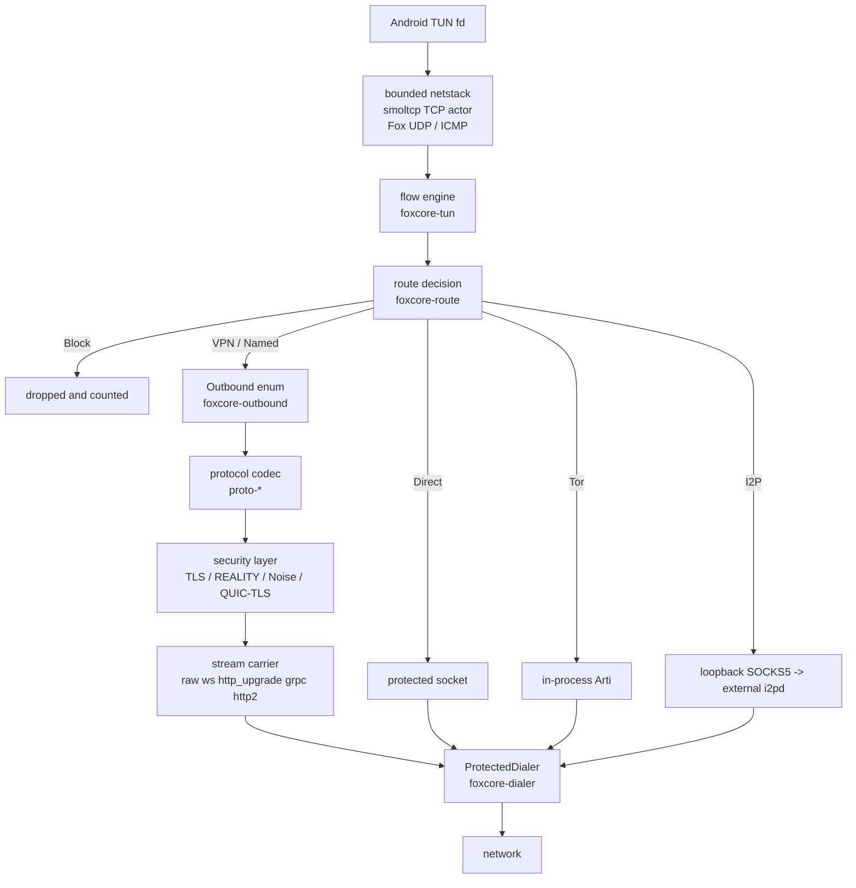
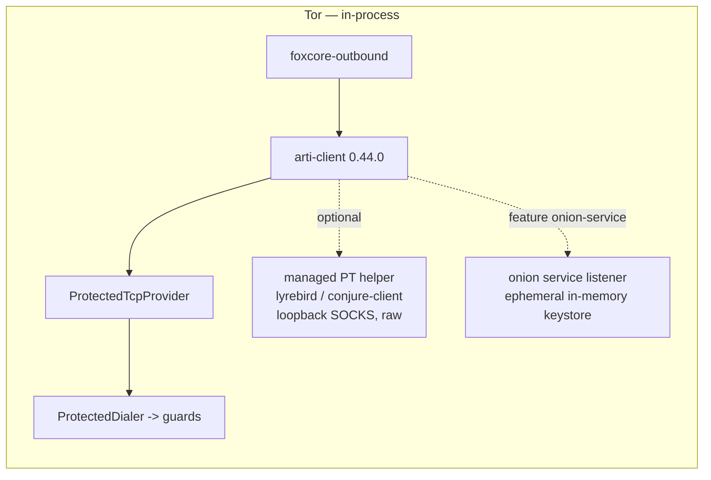
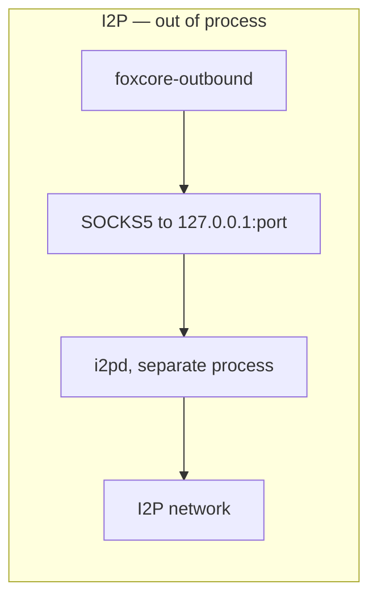
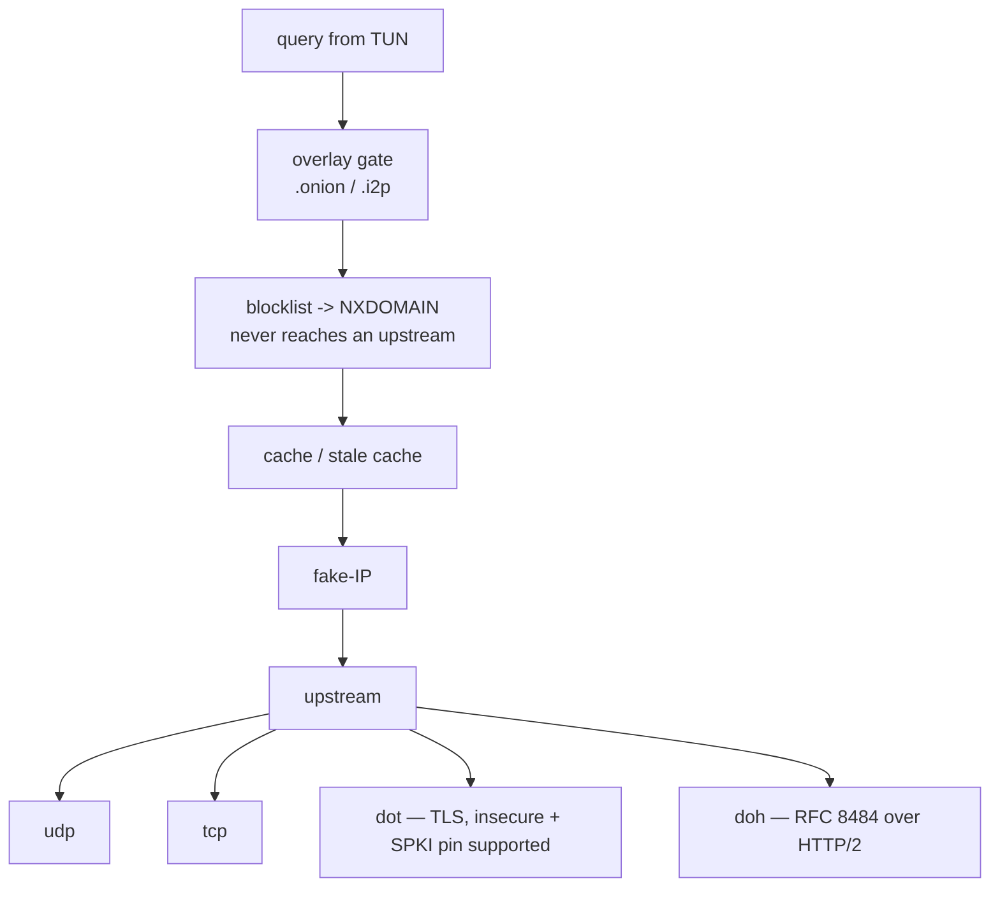
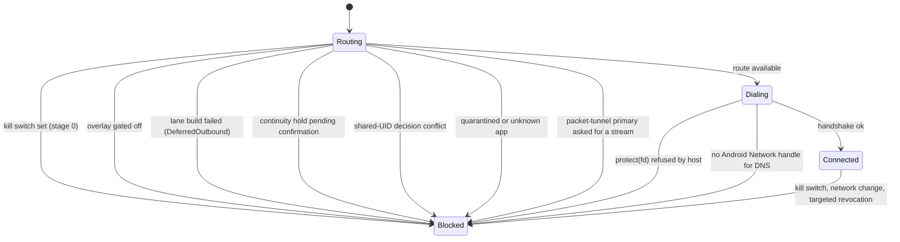

# 1. Protocols

Every outbound FoxCore implements, what carries it, what protects it, where it ends.

---

## 1.1 The stack



Layer order matters: the security layer sits **below** the stream carrier, so a WebSocket rides
inside TLS, not the other way round (`crates/foxcore-transport/src/lib.rs:67-96`).

`FlowStack` is the backend-neutral boundary presented to the flow engine
(`crates/foxcore-tun/src/netstack/mod.rs:249-312`). TCP is exact-pinned to smoltcp 0.14.0 with only
IP medium, IPv4/IPv6, TCP, Reno and async wake support; smoltcp UDP, DNS, fragmentation and automatic
ICMP echo are not compiled (`Cargo.toml:83-91`). One Tokio actor owns the smoltcp `Interface`,
`SocketSet` and tuple map. Before it hands an untrusted SYN to smoltcp it reserves the flow slot,
bounded accept capacity and the complete buffer charge, listens on the packet's exact destination,
and publishes the stream only after `Established` (`crates/foxcore-tun/src/netstack/actor.rs:262-282`,
`:565-617`, `:668-734`, `:818-831`). AnyIP supplies transparent IPv4/IPv6 admission, and the TCP
random seed comes fail-closed from the OS (`crates/foxcore-tun/src/netstack/actor.rs:262-270`). An
unpublished handshake holds its reservations for at most 30 seconds; timeout and passive-reset
states are reset and reaped without waiting for unrelated traffic to stop
(`crates/foxcore-tun/src/netstack/stream/smoltcp_tcp.rs:22-47`;
`crates/foxcore-tun/src/netstack/actor.rs:763-818`, `:895-900`).

The packet device has 256-packet ingress and egress bounds, and refuses to dequeue ingress until an
egress slot is available for smoltcp's paired receive/transmit token
(`crates/foxcore-tun/src/netstack/actor.rs:31-42`, `:49-99`,
`:136-180`). Its writer, TCP command, UDP reply and raw-response channels are also bounded; every
event-loop tick has explicit command and packet budgets before it yields
(`crates/foxcore-tun/src/netstack/actor.rs:242-282`, `:291-435`). TCP
admission shares a 64 MiB buffer budget, and each application-facing direction adds only one
MTU-sized channel chunk to the charged socket buffers
(`crates/foxcore-tun/src/netstack/actor.rs:668-734`;
`crates/foxcore-tun/src/netstack/stream/smoltcp_tcp.rs:176-189`).

UDP remains a Fox-owned five-tuple demultiplexer: an established flow retains 32 packets from the
TUN, all flows share a 256-packet reply queue, and overflow drops newest while incrementing the
public loss counter (`crates/foxcore-tun/src/netstack/mod.rs:89-130`, `:160-166`;
`crates/foxcore-tun/src/netstack/stream/udp.rs:20-88`, `:218-244`). `DatagramFlow` is public
(`crates/foxcore-tun/src/netstack/mod.rs:32-33`) and its `AsyncRead` adapter never discards a datagram
tail: a short buffer advances `read_offset`, and later reads finish that payload before dequeuing the
next; a zero-capacity buffer consumes nothing (`crates/foxcore-tun/src/netstack/stream/udp.rs:169-214`,
regression at `:334-383`). DNS interception therefore stays in the policy-aware flow engine, and
ICMPv4 echo uses the same bounded raw-response path
(`crates/foxcore-tun/src/netstack/mod.rs:1-9`, `:66-87`). On the WireGuard L3 path four
256-packet channels feed one TUN writer; `StackDevice` never creates a second writer
(`crates/foxcore-tun/src/flow/engine.rs:142-200`; `crates/foxcore-tun/src/ingress.rs:118-199`). Fatal
TUN reader or writer errors reach the engine with their original I/O kind. Cancellation signals the
stack actor, joins it and its writer with a one-second fallback bound, then shuts down and joins the
L3 helper set before the generation-owned runtime can release the sole TUN owner
(`crates/foxcore-tun/src/netstack/mod.rs:270-312`;
`crates/foxcore-tun/src/netstack/actor.rs:291-303`, `:460-554`;
`crates/foxcore-tun/src/flow/engine.rs:202-223`;
`crates/foxcore-runtime/src/start.rs:384-407`).

---

## 1.2 Config identifiers

`OutboundConfig` is internally tagged on `type`, `rename_all = "snake_case"` —
`crates/foxcore-api/src/config/outbound.rs:9-33`. Fifteen variants:

```
direct  vless  vmess  hysteria2  tuic  trojan  shadowsocks
i2p  tor  wireguard  selector  socks  http  naive
anytls      (explicit rename, outbound.rs:29-30)
shadowtls   (explicit rename, outbound.rs:31-32)
```

Stream carriers — `StreamTransportConfig`, tagged on `type`
(`crates/foxcore-api/src/config/transport.rs:11-54`):

```
raw  websocket  http_upgrade  grpc  http2
```

Bounds: ≤16 named outbounds (`crates/foxcore-api/src/config/engine.rs:74-78`), ≤64 selector members
(`crates/foxcore-api/src/config/selector.rs:9`), engine config ≤1 MiB
(`crates/foxcore-api/src/config/engine.rs:34-39`). Ids `default`, `primary`, `direct`, `block` are
reserved; `tor` and `i2p` are id-locked in both directions
(`crates/foxcore-api/src/config/engine.rs:86-115`).

---

## 1.3 Protocol matrix

| Protocol | Carried on | Security layer | Stream carriers | UDP | Terminated at |
|---|---|---|---|---|---|
| **VLESS** | TCP | rustls TLS **or** REALITY (exclusive); optional inner ML-KEM768+X25519 "VLESS Encryption" | all 5 | yes — `none`/`xudp`/`packetaddr` | remote VLESS server |
| **VLESS + Vision** | TCP only | TLS 1.3 required | raw only | **refused on port 443** | remote VLESS server |
| **VMess** | TCP | optional rustls TLS; no REALITY | all 5 | yes | remote VMess server |
| **Trojan** | TCP | TLS **mandatory** | all 5 | yes | remote Trojan server |
| **Shadowsocks / Outline** | TCP + native UDP | AEAD or AEAD-2022; optional `simple-obfs` http/tls, Outline salt prefix | all 5 (as native `v2ray-plugin`) | conditional | remote SS server |
| **Hysteria2** | **QUIC/UDP** (quinn) | TLS inside QUIC; optional **Salamander** packet obfs; port hopping | none | conditional on server | remote HY2 server |
| **TUIC v5** | **QUIC/UDP** (quinn) | TLS inside QUIC, TLS-exporter auth | none | conditional | remote TUIC server |
| **AnyTLS v2** | TCP | TLS mandatory; own mux + bounded padding above TLS | none by design | yes — UoT v2 | remote AnyTLS server |
| **ShadowTLS v3** | TCP | TLS 1.3 only, server proof + chained HMAC; inner protocol **hardcoded to Shadowsocks** | none | conditional — UoT v2 | ShadowTLS server → its inner SS |
| **Naive** | TCP | TLS mandatory, ALPN `h2`, HTTP/2 CONNECT + padding | none | **no** | remote naive server |
| **HTTP** | TCP | optional TLS | none | **no** | remote HTTP proxy |
| **SOCKS5** | TCP (+UDP) | **none** — no `tls` field exists | none | yes — UDP ASSOCIATE | remote/LAN/loopback proxy |
| **WireGuard / AmneziaWG** | **UDP** | Noise IKpsk2; AmneziaWG adds junk/header obfs only | n/a — L3 packet tunnel | yes (carries all IP) | remote WG peer |
| **Tor** | TCP guards | Arti's own crypto; bridges + managed pluggable transports | n/a | **no** | Tor network, in-process |
| **I2P** | TCP to `127.0.0.1` | none (plain SOCKS5, optional RFC 1929) | n/a | **no** | **external i2pd process** |
| **Selector** | — | inherits from active member | inherits | inherits | up to 64 members |
| **Direct** | TCP/UDP | none | n/a | yes | destination, protected socket |

Only VLESS, VMess, Trojan and Shadowsocks carry a `transport` field. Every other config has no such
field at all — the carriers simply do not apply (`crates/foxcore-android/src/capabilities.rs:441-658`).

REALITY and WireGuard are not standalone outbounds: REALITY is a security layer used only by VLESS;
WireGuard is only reachable as `OutboundMode::PacketTunnel`.

---

## 1.4 Tor and I2P are structurally different





| | Tor | I2P |
|---|---|---|
| `implementation` string | `in_process_arti` (`capabilities.rs:1058`) | `external_i2pd_socks5_loopback` (`:1081`) |
| Process ownership | core owns it | **not owned** — `unsupported: ["udp","process_ownership","clearnet"]` (`:1090`) |
| Listener | onion service only, gated on feature; only `BEGIN` on the configured port | **none** — `connect_datagram` returns `Unsupported` |
| Constraint re-check | — | endpoint must be loopback, destination must end `.i2p`, re-checked at construction |
| Cargo feature | **not a default feature** (`foxcore-outbound/Cargo.toml:32`) | default |

On the client side, `i2pd` ships as `libi2pd.so` in `jniLibs` (Android only executes from
`nativeLibraryDir`) and is launched by `I2pdRuntimeInstaller` / `RuntimeChildProcessLauncher`.
The Tor pluggable-transport helpers come from a Tor Expert Bundle in
`app/src/main/assets/tor/<abi>/tor/pluggable_transports/`.

Bridge selection is deliberately single-transport. `AUTO` resolves to one Snowflake transport
group; an explicit selection never falls through to another transport. For that one transport the
client tries the downloaded inventory, then the bundled inventory, and accepts the first non-empty
compatible set (`core/runtime/src/main/kotlin/com/foxhole/core/runtime/TorBridgeTorrcLines.kt:50-81`).
If no usable set exists, Tor preflight fails; the client does not fall back to direct Tor. Before the
plan reaches FoxCore, the client keeps only managed-transport protocol names referenced by the
selected `Bridge` lines and coalesces helpers that share one executable and argument vector
(`core/runtime/src/main/kotlin/com/foxhole/core/runtime/TorRuntimeInstaller.kt:169-198,274-305`).

---

## 1.5 DNS transports

The resolver is **not** in `foxcore-dns` (that crate is wire parsing only). The outbound DNS client
is `crates/foxcore-tun/src/dns/{proxy.rs,upstream.rs}`.



| `type` | Transport | Pool lanes | Note |
|---|---|---|---|
| `udp` | plain UDP/53 | 4 | |
| `tcp` | plain TCP/53 | 4 | |
| `dot` | DNS-over-TLS | 4 | supports `insecure` and `pinned_spki_sha256` |
| `doh` | DNS-over-HTTPS, **HTTP/2** via the `h2` crate | 1 (H2 already multiplexes) | URL must be HTTPS, no userinfo/fragment, ≤4096 bytes |

**DoQ and DNS-over-HTTP/3 are not implemented.** Published capability agrees:
`DnsCapabilities { udp, tcp, dot, doh_http2, fake_ip, private_namespaces_fail_closed: ["onion","i2p"] }`
(`capabilities.rs:1119-1126`).

`dns.route` ∈ `direct` | `primary` | `tor`. A Tor DNS route with the overlay disabled is
`PermissionDenied`, and the resolved outbound is re-checked against the overlay gates *after*
selection (`dns/proxy.rs:671-711`).

---

## 1.6 Fail-closed

The core never redirects protected traffic to `Direct` when the required route is unavailable.
Stated intent: "no silent downgrade when a protected route fails" (`README.md:110-119`).



### Why, path by path

| Path | Mechanism | Cite |
|---|---|---|
| **Global kill switch** | stage 0 of routing, ahead of every allowance — including explicitly allowed apps, `.onion`/`.i2p` auto-routes and locally answered ICMP echo | `config/policy.rs:63-67`; `foxcore-route/src/lib.rs:185-190`; LAN ingress `foxcore-runtime/src/lan.rs:73-76` |
| **`.onion` / `.i2p`** | refused rather than forwarded when fake-IP is off — "private overlay DNS is never forwarded to an upstream resolver". Tor/I2P routing *requires* `dns.mode='fake_ip'` or the profile is rejected at load | `foxcore-tun/src/dns/proxy.rs:248-268`, `:308-322`; `config/engine.rs:232-249` |
| **Overlay switched off** | `gated()` turns a Tor/I2P action into `Block` immediately; `.onion`/`.i2p` hosts are force-routed to the overlay lane *before* the route table and return `None` ⇒ Block if the lane is gated or absent | `foxcore-route/src/lib.rs:301-315`; `foxcore-tun/src/flow/select.rs:344-358`, `:379-389` |
| **Failed outbound build** | becomes a `DeferredOutbound` under the same id; the engine still starts and flows get `BlockReason::LaneUnavailable` — "never answered by another lane" | `foxcore-runtime/src/registry.rs:86-97`; `flow/select.rs:337-343` |
| **L3 packet-tunnel primary** | a WireGuard primary has no stream semantics, so the registry's `default` is a flagged direct socket that every consumer refuses: flow engine, DNS interceptor, LAN proxy, and two config-load rules | `foxcore-outbound/src/lib.rs:207-219`; `flow/select.rs:396-397`; `dns/proxy.rs:671-690`; `foxcore-runtime/src/lan.rs:80-92`; `foxcore-api/src/config/engine.rs:193-218` |
| **Network moved, no protected socket** | `socket = None` is the fail-closed state — packets dropped and counted, never queued; a bounded run of receive errors closes the tunnel until a rebind | `foxcore-tun/src/relay/engine.rs:149-152`, `:253-260`, `:289-317` |
| **Continuity hold** | turning off a continuity flag holds the lane blocked and raises `ConfirmationRequired`. There is deliberately no third outcome where packets keep moving; the removed `stop_engine_leaving_network_open` value is now *rejected* under `deny_unknown_fields` | `config/policy.rs:96-119`, `:139-146`, `:188-230` |
| **Shared UID / quarantine** | an Android shared UID resolving to a mixed decision fails closed to Block; quarantined and unknown apps never reach the network | `foxcore-route/src/lib.rs:289-297`, `:206-212` |
| **Protected socket refused** | `protect(fd)` returning false is a hard `PermissionDenied`, not a fallback | `foxcore-dialer/src/lib.rs:314-321` |
| **DNS without a network handle** | protected resolution requires a non-zero Android `Network` handle; otherwise `NotConnected` | `foxcore-dialer/src/lib.rs:130-137` |
| **Loopback inbound with a dead upstream** | answers `502`; never falls through to direct. VPN/direct dials keep a 30 s ceiling; Tor receives 75 s for a fresh circuit. Stop cancellation still wins over either dial and releases the bounded session permit | `crates/foxcore-android/src/capabilities.rs:1165-1177`; `crates/foxcore-component/src/lan.rs:114-121,286-291,821-830,927-939,963-988` |

### Protocol-level refusals (offered ≠ accepted)

| Refusal | Why |
|---|---|
| **ECH is all-or-nothing** — no `optional` mode | on rejection rustls has verified the cert against the ECH *public name*, so "continuing" means talking to the cover domain while the profile believes it reached its proxy (`config/tls.rs:39-68`) |
| ECH refused at config time for **hysteria2, tuic, shadowtls** | QUIC reports no ECH status so acceptance cannot be enforced; ShadowTLS v3 rewrites the session id ECH seals as AAD (`config/tls.rs:82-98`; `capabilities.rs:1101`) |
| **PQ downgrade guard** | `curve_preferences` *replaces* the provider list, so omitting `X25519MLKEM768` used to silently drop it. It is now prepended unless `allow_classical_only_key_exchange` is set (`foxcore-transport/src/tls.rs:468-486`) |
| **REALITY** refuses TLS 1.2 selection, HelloRetryRequest, certificate compression, session resumption; never performs Xray's crawler fallback | `capabilities.rs:746-770`; `proto-reality/src/lib.rs:3-7` |
| **VMess** rejects legacy `alter_id`; refuses a server instruction rather than obeying it | `proto-vmess/src/lib.rs:33-40`; `proto-vmess/src/stream.rs:236-243` |
| **TUIC** `zero_rtt_handshake` is representable but rejected at validation | `config/outbound.rs:381-387` |
| **Naive** padding is required; a server that does not negotiate it is refused | `proto-naive/src/lib.rs:3-8` |
| **Selector** probe URL must be plain `http://`; only stream proxies may join, so failover cannot change privacy class | `config/selector.rs:90-96`, `:26-31` |
| **Tor upstream** (Tor-over-VPN) must be a stream proxy — direct, I2P, nested Tor, WireGuard and selector refused | `foxcore-outbound/src/lib.rs:970-980` |
| **`http_upgrade`** fails closed unless the server answers `101`; never downgrades to a plain stream | `foxcore-transport/src/httpupgrade.rs:23-26` |
| **WebSocket** text frames and oversized messages fail closed (64 KiB duplex, 2 MiB max message) | `foxcore-transport/src/websocket.rs:24-28` |

A permanent "this protocol has no UDP" refusal is counted as `udp_unsupported` + `block_flow`,
**not** as a dial error, so a working fail-closed core does not read as a network fault
(`flow/select.rs:212-233`).

---

## 1.7 Not implemented

| Absent | Evidence |
|---|---|
| **mkcp / kcp** as a transport | zero implementation; `"kcp" \| "mkcp" => ProfileTransport::Kcp` at `foxcore-link/src/lib.rs:929` is a diagnostic label only, and the importer refuses transports it cannot build (`:1399-1401`) |
| **xhttp / splithttp** | zero occurrences anywhere in the repo |
| **DoQ, DNS-over-HTTP/3** | zero occurrences in `foxcore-tun/src/dns/` or `config/dns.rs` |
| **SOCKS-over-TLS** | `SocksConfig` has no `tls` field (`config/outbound.rs:58-73`) |
| **ShadowsocksR, ShadowTLS v1/v2** | ShadowsocksR has no implementation; ShadowTLS declares v1/v2 unsupported (`capabilities.rs:918-940`) |
| **Generic ShadowTLS inner protocol** | `ShadowTlsInnerConfig` has exactly one variant; the general `StreamDialer` detour seam does not exist yet (`config/outbound.rs:148-165`) |
| **SIP003 subprocess plugins** | only `v2ray-plugin` and `simple-obfs` are native; the family is refused, never substituted (`capabilities.rs:878-890`) |
| **WireGuard endpoint roaming, server role** | `unsupported: ["endpoint_roaming","server_role"]` |

Maturity ceiling in this build is `beta`; nothing claims `stable`, and
`live_interop_verified_this_build: false` (`capabilities.rs:1180-1200`). TUIC, AnyTLS, ShadowTLS and
AmneziaWG are `experimental`.

---

## 1.8 Inconsistencies found

No open protocol inconsistencies remain after this pass. The previous text and both top-level
capability tables named the removed embedded `ipstack` fork and omitted the global TCP memory and
raw-response queue bounds; they now describe the shipping smoltcp actor and Fox-owned UDP/ICMP
boundary. The 497-line transparent-accept proof was also a `#[cfg(test)]` module under `src/`; it is
now the integration contract `crates/foxcore-tun/tests/smoltcp_transparent_accept_contract.rs:1-497`,
with no production module surface. The loopback refusal description also hid one shared 30 s
upstream ceiling for VPN, direct and Tor; the route-aware 30/75 s split now matches fresh bridged-Tor
bootstrap while preserving bounded ownership (`crates/foxcore-component/src/lan.rs:114-121,286-291`).
The client enum comment also described `AUTO` as a recommendation-ordered multi-transport fallback,
although the runtime pins it to Snowflake and forbids cross-transport fallback; the comment and this
architecture set now match the selector
(`core/model/src/main/kotlin/com/foxhole/core/model/SettingsEnums.kt:260-270`;
`core/runtime/src/main/kotlin/com/foxhole/core/runtime/TorBridgeTorrcLines.kt:50-81`).
