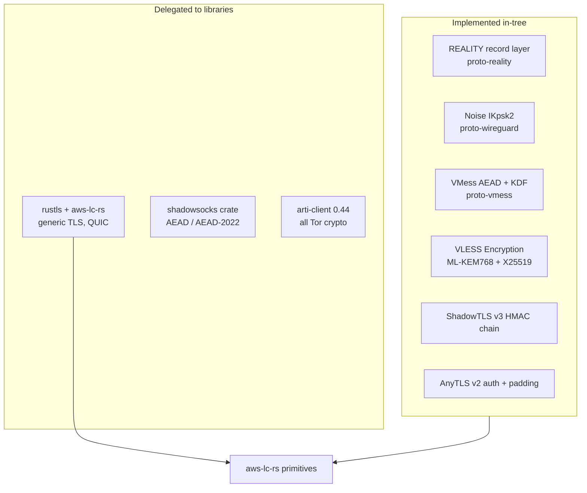
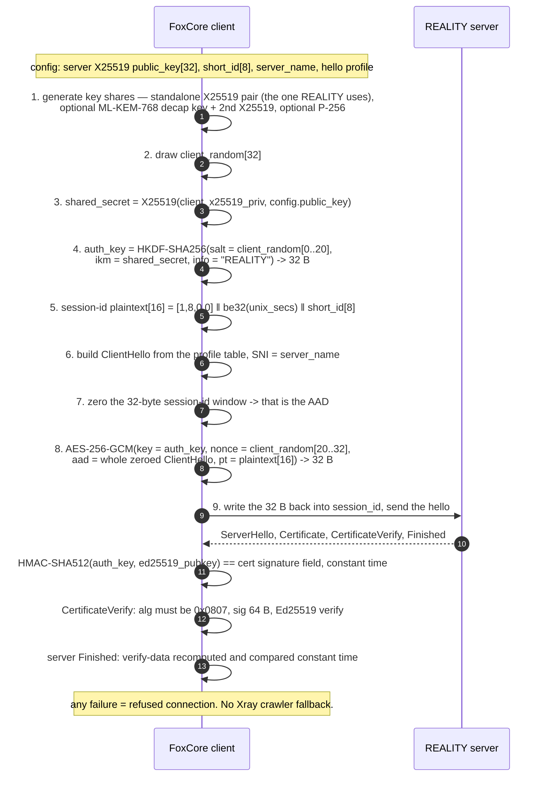
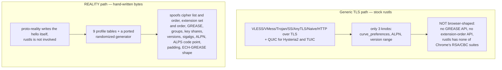
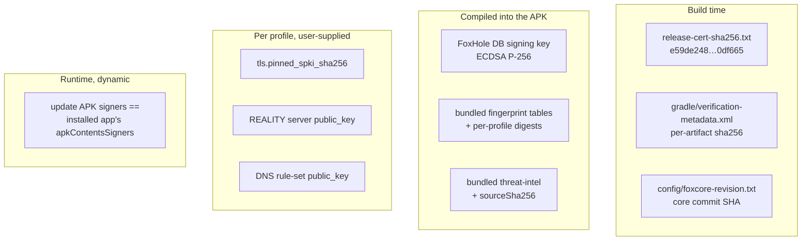

# 2. Cryptography

Per-protocol authentication, the post-quantum story, REALITY's derivation, and what is pinned.

---

## 2.1 Where the crypto lives

Fox-owned generic TLS explicitly builds rustls configurations with the `aws-lc-rs` provider because
`ring` has no ML-KEM (`crates/foxcore-transport/src/tls.rs:454-502`). The dependency graph still
contains `ring` through Arti, Shadowsocks compatibility and a negative ECH test; it is not the
provider selected by FoxCore's TLS builder.

Direct BoringSSL is deliberately not another backend. A rustls `CryptoProvider` controls suites,
groups, signatures, randomness and key loading, but not ClientHello extension order or layout. A
full BoringSSL `libssl` path would therefore be a separate unstable C++/FFI transport on Android; it
would not replace the hand-written REALITY record layer, Quinn, or Firefox/Safari profile shapes.
The BoringSSL-derived primitives needed here already arrive through `aws-lc-rs`.

---

## 2.2 Per-protocol authentication and key exchange

| Protocol | Authentication | Key exchange | Data AEAD |
|---|---|---|---|
| **VLESS** | plaintext UUID (16 B) in the header | none of its own — from the layer below | from the layer below |
| **VLESS Encryption** | suite `mlkem768x25519plus` | X25519 to the server long-term key **or** ML-KEM-768 encapsulation; PFS hop yields `mlkem_ss ‖ x25519_ss` (64 B) | AES-256-GCM or ChaCha20-Poly1305; keys via BLAKE3 `derive_key` |
| **VMess** | `cmdKey = MD5(uuid ‖ magic)`; AuthID = AES-128-ECB over `be64(secs) ‖ 3 rand ‖ be32(CRC32)`; header sealed AES-128-GCM | none — pre-shared UUID | AES-128-GCM or ChaCha20-Poly1305; length masking via SHAKE128 |
| **Trojan** | **SHA-224(password)**, lowercase hex, 56 ASCII bytes | none — from TLS/REALITY below | from TLS below |
| **Shadowsocks / SS-2022** | pre-shared key; method string → `CipherKind` | TCP subkey = `HKDF(key, salt)` | AEAD or AEAD-2022 (`2022-blake3-*`) |
| **Hysteria2** | HTTP/3 `POST /auth`, header `hysteria-auth: <password>` inside TLS; success is `:status 233` | TLS 1.3 inside QUIC | QUIC AEAD; optional Salamander XOR keystream = `BLAKE2b-256(key ‖ salt)` below QUIC |
| **TUIC v5** | UUID + **TLS exporter** token: `export_keying_material(32, label = uuid, context = password)`; zeroized after send | TLS 1.3 inside QUIC | QUIC AEAD |
| **AnyTLS v2** | **SHA-256(password)** ‖ `u16be(pad_len)` ‖ random padding; padding scheme id advertised as `padding-md5=<MD5 hex>` | TLS below | TLS below |
| **ShadowTLS v3** | **HMAC-SHA1** truncated to 4 bytes, written into the ClientHello session id at offset +28; server proof = chained `HMAC-SHA1(password, ServerRandom)`, constant-time compared | TLS 1.3 below | inner Shadowsocks; stage-2 unmask XORs with `SHA-256(password ‖ ServerRandom)` |
| **WireGuard** | Noise **IKpsk2**, `"Noise_IKpsk2_25519_ChaChaPoly_BLAKE2s"` | X25519; BLAKE2s-256, HMAC-BLAKE2s kdf1/2/3 | ChaCha20-Poly1305; XChaCha20-Poly1305 for cookie reply; `mac1 = BLAKE2s-128` |
| **AmneziaWG** | identical to WireGuard | identical | **obfuscation only — no crypto change** |
| **Naive** | `Proxy-Authorization: Basic` inside TLS | TLS below | TLS below; Variant1 zero padding on first 8 reads/writes |
| **SOCKS5** | RFC 1929 username/password **in the clear** | none | none |
| **HTTP proxy** | Basic auth | optional TLS | optional TLS |
| **REALITY** | see [2.4](#24-reality) | X25519 to the server REALITY key | AES-256-GCM for the auth blob; TLS 1.3 schedule for the session |
| **Tor** | delegated to `arti-client` 0.44.0 | delegated | delegated |
| **I2P** | none in-crate; optional RFC 1929 to the local i2pd | none | none |

Note that `SocksConfig` has no TLS field at all — a SOCKS5 outbound carries its credentials in
plaintext. It exists for loopback and LAN use.

---

## 2.3 Post-quantum

Two independent PQ surfaces, both **ML-KEM-768**. ML-DSA is *offered and never implemented*.

```mermaid
flowchart TD
    subgraph a["A. rustls path — generic TLS and QUIC"]
        A1["aws_lc_rs default_provider"] --> A2["group order:<br/>X25519MLKEM768, X25519,<br/>secp256r1, secp384r1"]
        A2 --> A3["a curve_preferences list that omits<br/>the hybrid gets it PREPENDED"]
        A3 --> A4["dropping it requires<br/>allow_classical_only_key_exchange"]
    end
    subgraph b["B. REALITY path — hand-written hello"]
        B1["own X25519MLKEM768, code point 0x11ec"] --> B2["client share ek(1184) + x25519(32) = 1216 B"]
        B2 --> B3["server share ct(1088) + x25519(32) = 1120 B"]
        B3 --> B4["secret mlkem_ss(32) + x25519_ss(32) = 64 B"]
    end
    subgraph c["C. VLESS Encryption — inner layer"]
        C1["ML-KEM-768 via aws-lc-rs"] --> C2["suite mlkem768x25519plus"]
        C2 --> C3["mlkem1024x448plus refused by name"]
    end
```

Config surface: `CurveGroup::X25519MlKem768`, serde name `x25519mlkem768`, alias `X25519MLKEM768`
(`config/tls.rs:124-130`). Hysteria2 and TUIC inherit the group order through
`rustls_client_config`.

### Which REALITY profiles offer the hybrid

| Profile | `X25519MLKEM768` group | ML-DSA sigalgs |
|---|---|---|
| `chrome_151` | yes | **`0x0904 mldsa44`, `0x0905 mldsa65`, `0x0906 mldsa87`** |
| `chrome_133`, `chrome_131` | yes | no |
| `firefox_153`, `firefox_148` | yes | no |
| `safari_26_3` | yes | no |
| `edge_85`, `ios_14`, `qq_11_1` | no | no |

Firefox reuses one classical scalar across the standalone and hybrid shares
(`reuse_classical_key_share`); Chrome uses two independent ones
(`reality_key_exchange.rs:171-209`).

**ML-DSA is a shape, not a capability.** The three FIPS 204 code points are prepended to Chrome's
eight classical schemes and the list length grows `0x0010 → 0x0016`
(`hello_profile.rs:788-815`). None is implemented: the certificate verifier accepts only Ed25519
(`reality_client_verify.rs:217-225`), and `reality_mldsa65` is declared unsupported in the
capability document. There is **no Kyber, Dilithium or ML-DSA verification code anywhere in either
repository** — every hit is a table entry or a comment.

---

## 2.4 REALITY

### Client derivation, in order

| Step | Primitive | Cite |
|---|---|---|
| ECDH | `aws_lc_rs::agreement::X25519` | `reality_auth.rs:54-84` |
| Auth key | HKDF-SHA256, salt exactly 20 B, info `b"REALITY"` | `reality_auth.rs:98-114` |
| Session-id seal | AES-256-GCM, nonce exactly 12 B, AAD = whole ClientHello | `reality_auth.rs:129-158` |
| Cert HMAC | HMAC-SHA512 over the 32-byte Ed25519 SPKI, `subtle::ct_eq` | `reality_client_verify.rs:84-146` |
| CertificateVerify | Ed25519 over `0x20 × 64 ‖ "TLS 1.3, server CertificateVerify" ‖ 0x00 ‖ transcript_hash` | `reality_client_verify.rs:214-290` |
| TLS 1.3 schedule | in-crate HKDF-Expand-Label / Derive-Secret, SHA-256 or SHA-384 per suite | `reality_tls13_keys.rs:24-140` |

`short_id` is hex, ≤16 chars, even length, **right-padded with zeros** to 8 bytes
(`reality_util.rs:34-54`). `auth_key`, `public_key`, `short_id` and `server_name` are zeroized on
drop (`reality_client_connection.rs:138-169`).

Untrusted handshake plaintext is accumulated only up to 64 KiB and the limit is checked before the
buffer grows (`reality_client_connection.rs:65-78`, `:698`). After the handshake, pending encrypted
records plus buffered application plaintext share one 64 KiB budget; a blocked network therefore
backpressures the application rather than growing two independent queues
(`reality_client_connection.rs:1012-1018`; `reality_reader_writer.rs:61-85`).

`server_name` is the SNI written into the parroted hello and must be an ASCII DNS name — IP literals
are rejected. There is **no client-side "dest" or fallback-target concept**; that is server-side
REALITY. This client only writes the SNI and refuses anything that is not a REALITY-signed
certificate.

---

## 2.5 TLS fingerprinting — two disjoint mechanisms

The two must not be conflated. The core's own README is explicit that the generic TLS path is
distinguishable from a browser — measured at 10 cipher suites and 11 extensions against Chromium's
15 and 16 — and that it is not reachable by configuration
(`foxhole-core/README.md:59-68`). `chromium_tls_fingerprint` is reported as `unsupported`.

**Profiles implemented** (`capabilities.rs:1102-1114`): `chrome_151`, `chrome_133`, `chrome_131`,
`edge_85`, `safari_26_3`, `ios_14`, `qq_11_1`, `firefox_153`, `firefox_148`, plus `random` (one
modern table chosen per process) and `randomized` (a fresh generated hello per connection). Seven
tables are transcribed from uTLS; `chrome_151` and `firefox_153` come from first-party captures.

**Refused rather than substituted**: `360` and `android` — both TLS 1.2 parrots that send no
`key_share`, and REALITY derives its auth key from the client's X25519 share, so no REALITY
handshake is possible with that hello (`capabilities.rs:1117`).

**Offered ≠ implemented.** The hello advertises TLS 1.2, secp256r1/384r1 without shares,
HelloRetryRequest, brotli certificate compression, PSK/0-RTT and (on `chrome_151`) ML-DSA. A server
that takes any of them up is refused, not downgraded to.

### Table feed

Only tables travel; the generator is compiled in. `install_fingerprint_tables`
(`runtime_tables.rs:39-70`) bounds the document; parsing requires schema 1, rejects duplicate names
and skips names this build does not implement (`:93-142`). Every `fingerprint_sha256` is re-derived
over canonical ASCII JSON (`:154-169`). Any failure refuses the whole document. See
[03 — Updates and data delivery](03-updates-and-data-delivery.md).

---

## 2.6 What is pinned, and where

| Pinned | Kind | Location |
|---|---|---|
| FoxHole DB manifest key | ECDSA P-256 SPKI, PEM literal | `app/src/main/kotlin/com/foxhole/guard/runtime/FoxholeDb.kt:47-53` |
| …its DER SHA-256 | `3acd123f…98d69` | `FoxholeDb.kt:55-56` |
| …base64 for the Rust core | derived from the PEM | `FoxholeDb.kt:58-64`; consumed at `DnsFilterAssetInstaller.kt:255-258` |
| TLS server SPKI pin | base64 SHA-256 of `subjectPublicKeyInfo`, must decode to 32 B; **replaces** WebPKI verification when set | field `config/tls.rs:19`; check `foxcore-transport/src/tls.rs:543-568` |
| DNS rule-set signing key | per-source, from config; base64 SPKI or raw P-256 point, 1..4096 B; `ECDSA_P256_SHA256_ASN1` | `config/dns.rs:102-134`; `foxcore-route/src/ruleset.rs:13`, `:250-296` |
| Per-fingerprint-table digest | `fingerprint_sha256`, re-derived in the core before install | `runtime_tables.rs:137`, `:154-169` |
| Threat-intel source digest | `sourceSha256: 6052636f…4864e` | `app/src/main/assets/sentinel/threat-intel.source.json:7` |
| Third-party app identity | `KnownAppConfig.signing_digest` — hex SHA-256 of another app's signing cert, so a repackaged app fails closed | `config/policy.rs:212-217`; `AndroidApplicationIdentityResolver.kt:78-96` |
| Gradle dependencies | per-artifact SHA-256 | `gradle/verification-metadata.xml` |
| Release APK certificate | `e59de2486084c38f3c77e9df0eb5eff9a4559f3c68024f1208e0e9c04b0df665` | `config/release-cert-sha256.txt` — **build-time check only** |
| FoxCore revision | exact release commit in `config/foxcore-revision.txt` | local Gradle checks the sibling Git HEAD and refuses release mismatches (`app/build.gradle.kts:188-245`) |

**Not pinned:**

- **Tor directory authorities** — arti owns them; no key material in either repo.
- **APK signing certificate at runtime** — there is no literal. `AppUpdateApkVerifier` requires the
  candidate's `apkContentsSigners` digest set to equal the **currently installed app's**, fail-closed
  on an empty set (`AppUpdateApkVerifier.kt:63-97`). `signingCertificateHistory` is deliberately not
  used, so a rotated-away key is refused.
- **No OkHttp `CertificatePinner`** anywhere. Transport hardening is
  `android:usesCleartextTraffic="false"` plus the public-HTTPS URL policy.
- **No Ed25519, minisign or PGP** update signing. The only Ed25519 in the tree is REALITY's *server*
  certificate key, which is authenticated by HMAC-SHA512 under the derived `auth_key` — not pinned.

The pinned PEM in `FoxholeDb.kt:47-53` was verified byte-for-byte against
`foxhole-db/manifest.public.pem`, and its DER SHA-256 against `manifest.json`'s `key_sha256`.

---

## 2.7 Inconsistencies found

- The previous text called `aws-lc-rs` the only primitive provider, while the actual dependency
  graph still contains `ring`. Fox-owned TLS selects aws-lc-rs; removing every transitive `ring`
  consumer is a separate supply-chain task and is not a reason to add BoringSSL.
