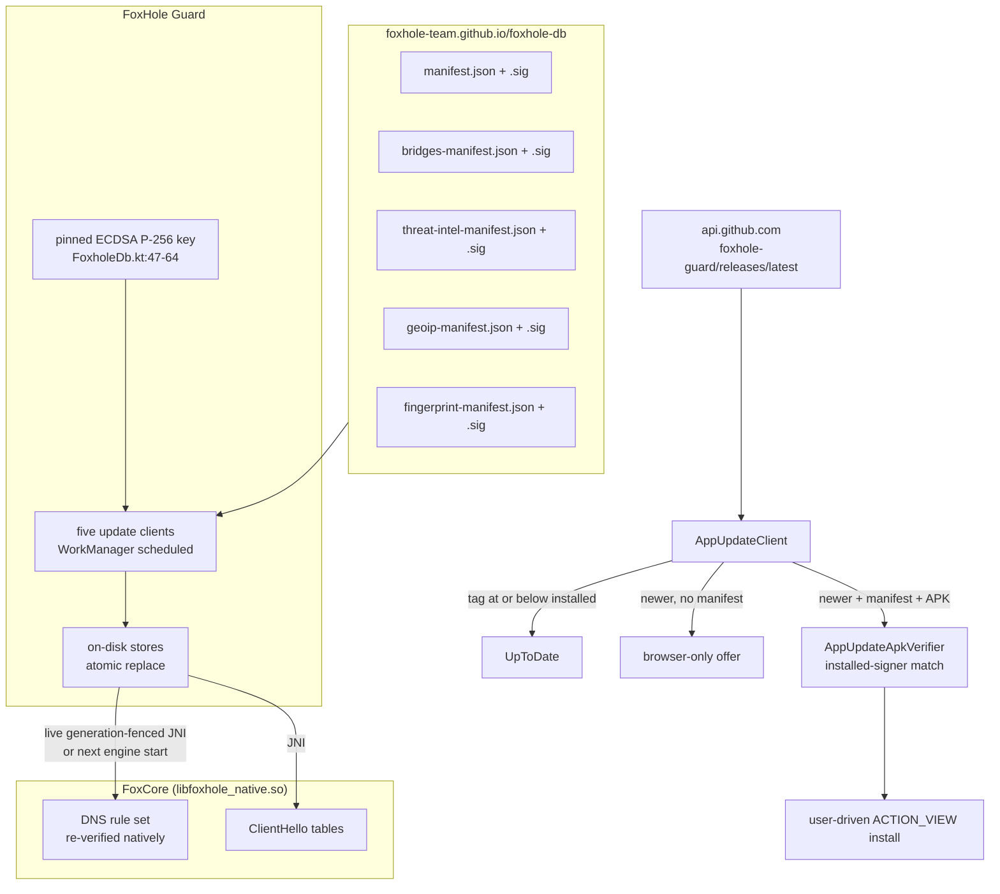
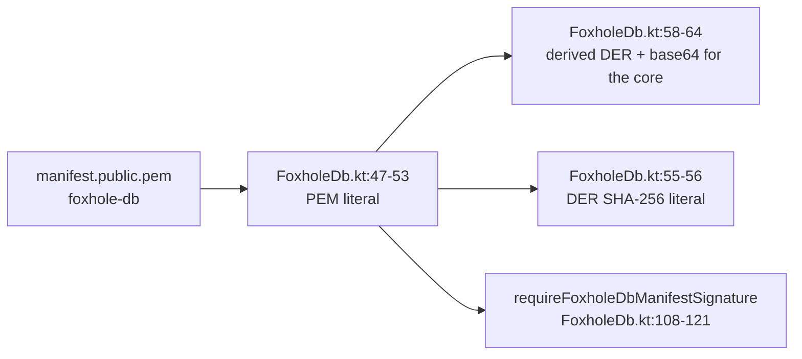
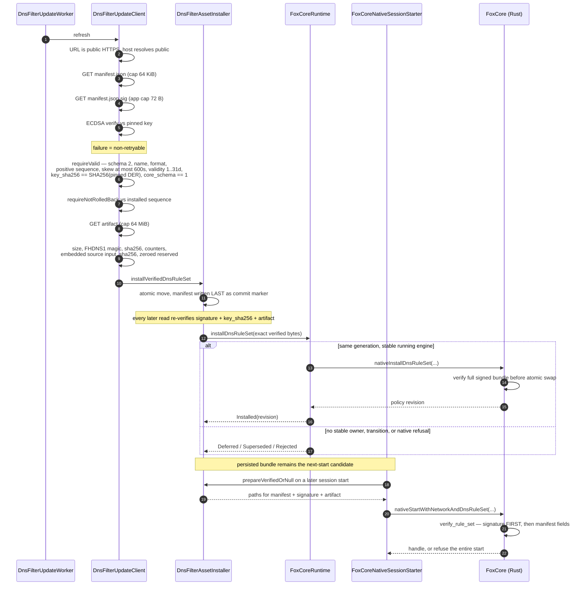
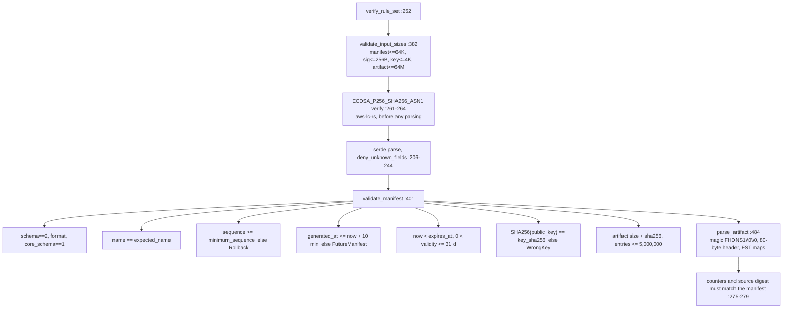
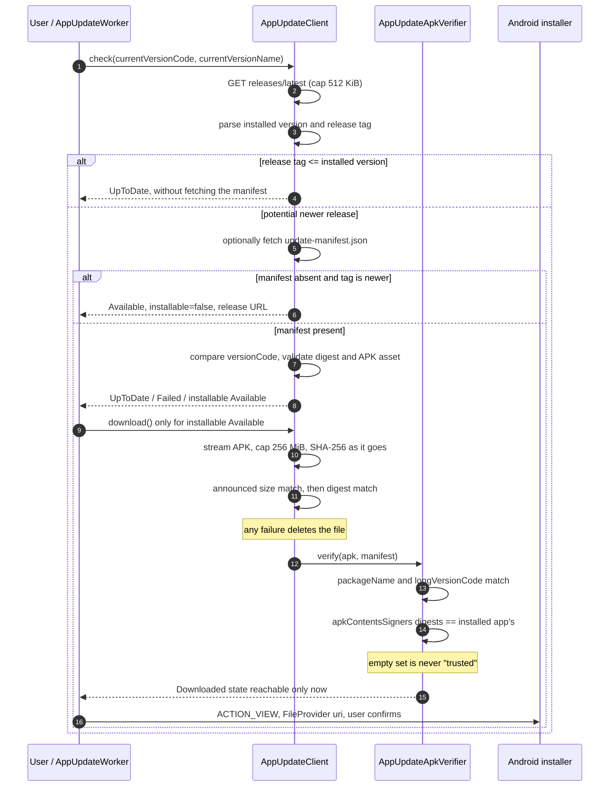

# 3. Updates and data delivery

Two independent channels: **five signed data feeds** published together from FoxHole DB, and the
**APK update channel** from GitHub Releases. They share no trust anchor.

---

## 3.1 The whole picture

| Channel | Trust anchor | Signature over |
|---|---|---|
| Data feeds | ECDSA P-256 key pinned in the **app** (`FoxholeDb.kt`); the core takes it from engine-config JSON and pins nothing itself | the manifest bytes |
| APK | the certificate the **currently installed app** is signed with | the APK itself (Android signing scheme) |

The APK update manifest is *not* signed by the FoxHole DB key, and there is no static
certificate-hash literal in the client — see [3.6](#36-apk-update-channel).

---

## 3.2 The pinned key

| Item | Value / location |
|---|---|
| Algorithm | ECDSA P-256, `SHA256withECDSA`, DER signature |
| PEM literal | `app/src/main/kotlin/com/foxhole/guard/runtime/FoxholeDb.kt:47-53` |
| DER SHA-256 | `3acd123f1fd03f8aee97b2e71029ba1f6efdd9c17703419d7cda78a790198d69` — `FoxholeDb.kt:55-56` |
| Base64 DER handed to Rust | derived from the PEM at `FoxholeDb.kt:58-64`, consumed at `DnsFilterAssetInstaller.kt:255` |
| Failure mode | `check(...)` → `IllegalStateException`, treated as **non-retryable** |
| Derivation test | `app/src/test/kotlin/com/foxhole/guard/runtime/FoxholeDbSigningKeyContractTest.kt:13-28` |

All five manifest URLs derive from **one** configurable base (`FoxholeDb.kt:29-45`); artifacts resolve
relative to their manifest URL. Redirecting the base moves every feed together. **The pin does not
move with it** — a mirror is only usable if it is published by the same tooling.

Every request additionally passes `requirePublicHttpsUrl(resolveHost = true)`
(`core/network/src/main/kotlin/com/foxhole/core/network/PublicUrlPolicy.kt:67-85`): HTTPS only, and
the resolved addresses must not be
private or loopback.

---

## 3.3 Verification chain — DNS rule set (the strictest)

Client-side sites: `DnsFilterUpdateClient.kt:290-316` (signature), `:319-354` (manifest),
`:356-371` (rollback), `:374-393` (artifact); persistence
`DnsFilterAssetInstaller.kt:48-76`, re-verification on read `:107-139`; live hand-off
`DnsFilterUpdateRepository.kt:90-123,170-193`, graph wiring `FoxholeAppGraph.kt:171-181`, and the
generation-fenced call `FoxCoreRuntime.kt:732-768,1048-1076`. Start payload selection and dispatch are at
`FoxCoreNativeSessionStarter.kt:79-105,252-283`.

### The native half

The core re-does the whole check on bytes the app already validated —
`foxhole-core/crates/foxcore-route/src/ruleset.rs`:

`RuleSetError` variants are the refusal vocabulary: `WrongKey`, `InvalidSignature`,
`InvalidManifest`, `UnsupportedManifest`, `WrongIdentity`, `Rollback`, `FutureManifest`,
`ExpiredManifest`, `ArtifactMismatch`, `InvalidArtifact`, `Truncated`, `TooLarge`.

There is deliberately **no** unsigned network update entry point. APK-trusted bundled bytes use
`nativeStartWithNetworkAndTrustedDnsRuleSet`; persisted network bytes use the signed atomic start
(`crates/foxcore-android/src/lib.rs:211-268`). After persistence, the current app also sends the
exact signed bytes through `nativeInstallDnsRuleSet` (`:327-350`). A stable current generation
adopts the verified replacement live; a missing or transitioning owner defers it to the next
signed start, and every native refusal leaves the current rules active.

---

## 3.4 Per-feed comparison

| Feed | Manifest schema | Rollback anchor | Expiry | `min_app_version` | Extra artifact check |
|---|---|---|---|---|---|
| DNS | 2 | **monotonic `sequence`**, equal sequence must carry the same sha256 | `expires_at_unix`, ≤31 d | n/a (uses `core_schema`) | FST header, counters, embedded input digest |
| Threat intel | 1 | `generated_at` strictly newer | device rejects age >45 d | **yes** | JSON parse + `supportsSchema` |
| TLS fingerprints | 1 | `generated_at` strictly newer | device rejects age >45 d | **yes** | per-profile digest re-derived, count must match |
| GeoIP | 1 | persisted `generated_at` floor | device rejects age >45 d | **yes** | range re-parse, `MIN_RANGES_PER_FAMILY` |
| Tor bridges | 1 | persisted `generated_at` floor | device rejects age >45 d | **yes** | bridge-line shape, `MIN_BRIDGE_LINES` |

> **Closed.** GeoIP and the bridges mirror had no ordering check: a validly signed *older*
> manifest read as "changed" and installed, and neither enforced `min_app_version`. Both now refuse
> a rollback and check the version. The bridge floor is persisted rather than process-scoped —
> a memory-only floor reopened the window on every cold start.

Rollback floors are stored beside the feed: `sentinel/threat-intel-remote.generated-at`
(`FileThreatIntelStore.kt:47-68`), `fingerprints/fingerprints-remote.generated-at`
(`FileTlsFingerprintStore.kt:35-49`), the GeoIP stamp (`GeoIpUpdateClient.kt:217-233,392`) and the
Tor bridge stamp (`TorBridgeUpdateClient.kt:62-81,258`). The DNS floor is read from the on-disk
manifest (`DnsFilterAssetInstaller.kt:84-100`) and passed to the core as `minimum_sequence`.

DNS carries an explicit expiry and ≤31-day validity window. The other four are bounded on the phone
by `requireFreshFoxholeDbManifest` to at most 45 days old (`FoxholeDb.kt:70-88`), matching the
publisher-side `MAX_AGE_DAYS=45` gate.

---

## 3.5 When a document takes effect

```mermaid
flowchart TD
    subgraph dnsp["DNS rule set — persist first, then live or atomic-start activation"]
        D1["DnsFilterAssetInstaller<br/>atomic three-file bundle"] --> D2["prepareVerifiedOrNull<br/>re-verify on read"]
        D1 --> D6["LiveActivatingDnsRuleSetStore<br/>exact verified bytes"]
        D6 --> D7["FoxCoreRuntime.installDnsRuleSet<br/>generation-fenced"]
        D7 -->|"same trust, stable engine"| D8["nativeInstallDnsRuleSet<br/>commit policy revision"]
        D2 --> D3["FoxCoreDnsRuleSetBootstrap<br/>signedUpdate paths"]
        D3 --> D4["FoxCoreNativeSessionStarter<br/>read bounded bytes"]
        D4 --> D5["nativeStartWithNetworkAndDnsRuleSet<br/>verify before first DNS query"]
        D7 -->|"deferred / superseded / refused"| D2
    end

    subgraph fpp["TLS fingerprint tables"]
        F1["FileTlsFingerprintStore<br/>temp + rename"] --> F2["TlsFingerprintProvider.documentInEffect"]
        F2 --> F3["TlsFingerprintTableInstaller.install"]
        F3 --> F4["nativeInstallTlsFingerprintTables"]
        F4 -->|"negative return"| F5["nativeClearTlsFingerprintTables<br/>fall back to compiled-in tables"]
    end

    subgraph other["The other three — never touch the data plane"]
        T1["threat-intel.json"] --> T2["FileThreatIntelStore, read lazily by Sentinel"]
        G1["dbip CSVs"] --> G2["GeoIpDatabaseStore + TorGeoIpCountryResolver.invalidateShared"]
        B1["bridges.json"] --> B2["TorBridgeStore, applies at next Tor start"]
    end
```

The DNS immutable fingerprint includes only bootstrap presence, rule-set name and pinned public
key. Therefore enabling filtering or rotating trust replaces the engine atomically, while sequence,
artifact hash and file paths can change through live install without restarting the tunnel.

The DNS update repository wraps the durable store and invokes the runtime only after all three
exact verified byte arrays have been committed (`DnsFilterUpdateRepository.kt:90-123,170-193`).
`FoxCoreRuntime.installDnsRuleSet` snapshots the handle and generation only in a stable `RUNNING`
state, invokes native verification, then commits the returned revision only if that owner is still
current (`FoxCoreRuntime.kt:732-768,1048-1076`). Deferred, superseded, or rejected live activation does not
discard the durable bundle: the next session re-reads it and uses the signed atomic start.

What the core does with a fingerprint document (`proto-reality::install_fingerprint_tables`,
`crates/proto-reality/src/reality/runtime_tables.rs:39-70`): bounded size, JSON object, schema check,
no duplicate names, every entry must map to a profile this build already implements, and
`verify_declared_digest` (`:154-169`) re-derives each `fingerprint_sha256`. Any failure refuses the
**whole** document — never a partial install. A feed can change *which bytes a known parrot sends*
and nothing else.

The bridge feed is also input, not authority to change the selected pluggable transport. At the
next Tor start, `AUTO` means Snowflake and an explicit choice stays that exact transport; the client
tries downloaded bridges first and the bundled inventory second **within the same transport**
(`core/runtime/src/main/kotlin/com/foxhole/core/runtime/TorBridgeTorrcLines.kt:50-81`). If neither
source has a compatible bridge and executable, startup fails closed. Only protocols actually named
by the final `Bridge` lines survive into the managed-transport plan
(`core/runtime/src/main/kotlin/com/foxhole/core/runtime/TorRuntimeInstaller.kt:169-198,296-305`).

> **Closed.** The installer's comment claimed it ran "after every successful feed update" while it
> had exactly one call site, `FoxholeVpnService.onCreate()` — so a table set downloaded into a live
> VPN process did nothing until the service was recreated. The hand-off now happens in
> `TlsFingerprintUpdateRepository.refreshNow()`, the single choke point all three refresh paths go
> through; app and service share one process, so the core picks it up in place.

---

## 3.6 APK update channel

| Fact | Value |
|---|---|
| Default endpoint | `https://api.github.com/repos/foxhole-team/foxhole-guard/releases/latest` — `AppUpdateClient.kt:394` |
| Overridable | yes, `updateSources.appReleasesUrl` + optional bearer token |
| Token scope | attached **only** to the exact configured host; never to the default feed, never across a redirect — `AppUpdateClient.kt:372-389` |
| Manifest | `update-manifest.json` asset: `versionCode, versionName, apkName, apkSha256, notes` — `AppUpdateClient.kt:36-43` |
| Matching version | a parsable release tag at or below the installed version returns `UpToDate` before any manifest request — `AppUpdateClient.kt:160-180` |
| Newer release without manifest | returns `Available(installable=false)` with release notes/link rather than an update-check failure — `AppUpdateClient.kt:181-209` |
| Manifest signed? | **No.** No `.sig` is fetched anywhere in this client |
| Real anchor | package/version checks plus signer-certificate set equality with the installed app — `AppUpdateApkVerifier.kt:15-39` |
| Which signers | `apkContentsSigners`, deliberately **not** `signingCertificateHistory`, and empty sets never match — `AppUpdateApkVerifier.kt:49-80` |
| Static cert pin | none in the client. `foxhole_guard/config/release-cert-sha256.txt` (`e59de248…0df665`) is a **build-time** check, not a runtime one |
| Install | user-driven `ACTION_VIEW`, no `PackageInstaller` session, no silent install — `HomeViewModelAppUpdateSupport.kt:99-126` |
| Channel gate | `github` enables the updater; F-Droid reproduces the upstream GitHub-channel APK (`metadata/com.foxhole.guard.yml:51-52`). The separate `fdroid` channel properties remain available for alternate builds (`app/build.gradle.kts:260-266`). |

The manifest digest proves the bytes match what the source described; it does **not** prove the
source is ours, because the releases URL and token are user-editable settings. That is why the
verifier re-reads the archive through `PackageManager` before the installer is ever shown.

---

## 3.7 Guard release provenance and F-Droid updates

Guard release publication requires a GitHub-verified `main` commit and an unexpired,
successful signed `dev` candidate with the same source tree. It verifies the candidate,
then builds a new signed APK from that exact `main` commit; packaging compares the
APK's root AGP VCS revision with `CANDIDATE.json.sourceCommit`. Matching trees alone do
not authorize substituting the candidate APK for the release APK
(`foxhole_guard/.github/workflows/release.yml:26-170,172-252`;
`foxhole_guard/scripts/package-release-candidate.sh:339-348,518`;
`foxhole_guard/scripts/verify-apk-source.py:9-29`).

After signing, SBOM, native and package checks, the workflow creates a tag directly
at the built commit. Draft assets are downloaded and compared before publication;
existing tags and releases are refused, and a failed upload leaves its tag/draft for
owner recovery instead of deleting history
(`foxhole_guard/.github/workflows/release.yml:155-165,217-252,272-360`).

F-Droid's `AutoUpdateMode: Version` and tag check generate future build entries from
the latest recipe. F-Droid obtains `FoxHoleCore` as a srclib at a fixed bootstrap SHA.
Prebuild validates the checked-out app's `config/foxcore-revision.txt`, fetches that SHA
inside the srclib and verifies its detached HEAD before Cargo or Gradle runs. Changing
the app pin selects a different Core without changing the bootstrap srclib revision.
Pinned tools, the upstream binary URL and signer verification remain recipe inputs
(`foxhole_guard/metadata/com.foxhole.guard.yml:15-16,27-53`).
Build 117 keeps its historical candidate SHA because the published 0.1.0 APK embeds that
SHA; later release APKs must embed the commit their tag resolves to
(`foxhole_guard/metadata/com.foxhole.guard.yml:19-21`).

---

## 3.8 Smaller inconsistencies found

| Finding | Where |
|---|---|
| DNS and threat-intel re-implement signature verification inline (`DnsFilterUpdateClient.kt:290-316`, `ThreatIntelUpdateClient.kt:178-198`) instead of calling the shared `requireFoxholeDbManifestSignature`. GeoIP/bridges/fingerprints use the shared helper. | client |
| The Kotlin JSON parser uses `ignoreUnknownKeys = true` while the Rust core uses `deny_unknown_fields`. The DNS builder comment claims both consumers deny. | both |

> **Closed in this pass.** Earlier documentation said the DNS updater only persisted bundles and
> that the APK updater required a manifest before it could report `UpToDate`. Both claims
> contradicted current production paths and are corrected above.

> **Release documentation correction.** The prior channel table described F-Droid as using
> the separate `fdroid` updater channel. The accepted reproducible recipe actually selects
> `github` to reproduce the upstream signed binary; the table now follows that recipe.

> **Source-layout correction.** Core selection now happens inside the F-Droid srclib,
> following maintainer review. The previous claim that the app-tree scanner removes
> Core fuzz fixtures no longer describes this layout; no such scanner guarantee is made.
