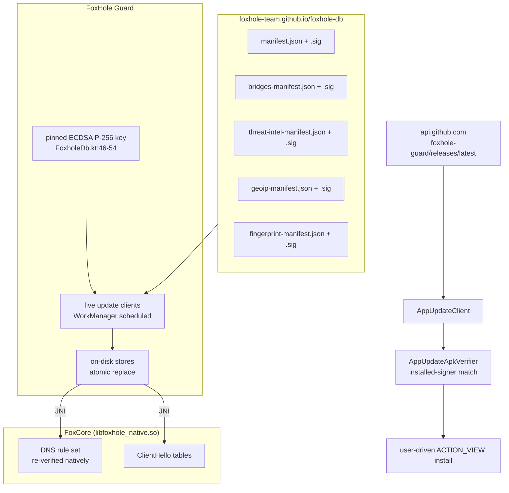
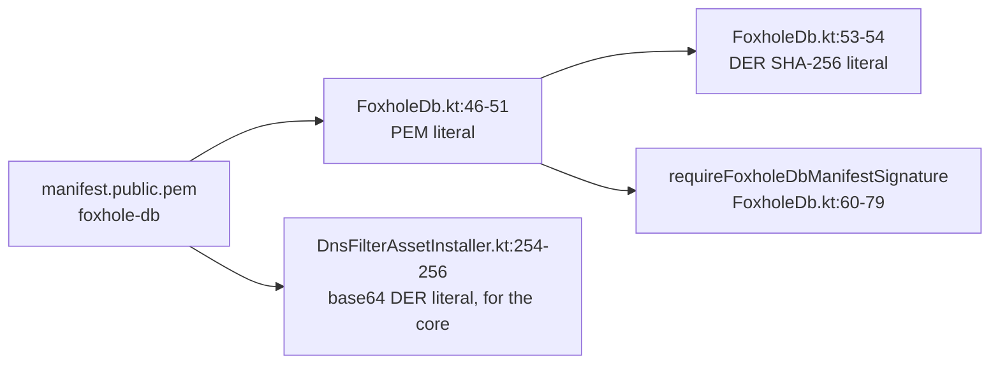
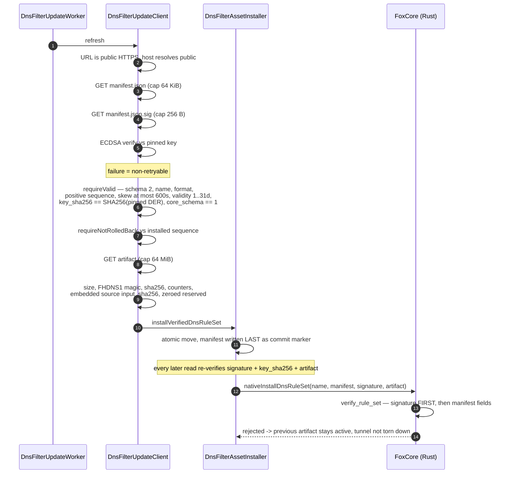
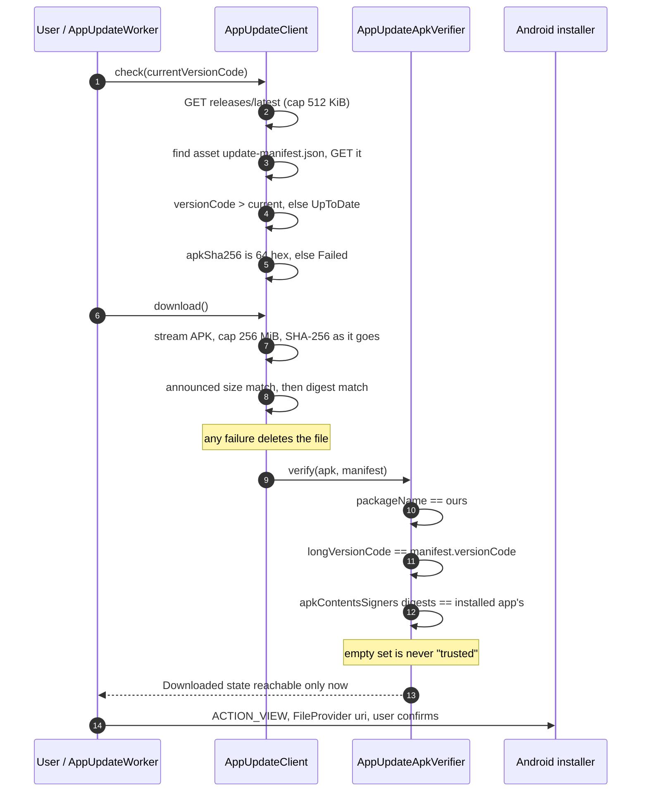

# 3. Updates and data delivery

Two independent channels: **signed data feeds** from FoxHole DB — four published, a fifth (TLS
fingerprint tables) built and verified but withheld until the core revision it mirrors is public —
and the **APK update channel**
from GitHub Releases. They share no trust anchor.

---

## 3.1 The whole picture

| Channel | Trust anchor | Signature over |
|---|---|---|
| Data feeds | ECDSA P-256 key pinned in the **app** (`FoxholeDb.kt`); the core takes it from engine-config JSON and pins nothing itself | the manifest bytes |
| APK | the certificate the **currently installed app** is signed with | the APK itself (Android signing scheme) |

The APK update manifest is *not* signed by the FoxHole DB key, and there is no static
certificate-hash literal in the client — see [3.6](#36-apk-update-channel).

---

## 3.2 The pinned key

| Item | Value / location |
|---|---|
| Algorithm | ECDSA P-256, `SHA256withECDSA`, DER signature |
| PEM literal | `app/src/main/kotlin/com/foxhole/guard/runtime/FoxholeDb.kt:46-51` |
| DER SHA-256 | `3acd123f1fd03f8aee97b2e71029ba1f6efdd9c17703419d7cda78a790198d69` — `FoxholeDb.kt:53-54` |
| Base64 DER copy handed to Rust | `DnsFilterAssetInstaller.kt:254-256` |
| Failure mode | `check(...)` → `IllegalStateException`, treated as **non-retryable** |
| Copy-equality test | `app/src/test/kotlin/com/foxhole/guard/runtime/FoxholeDbSigningKeyContractTest.kt:15-27` |

All five manifest URLs derive from **one** configurable base (`FoxholeDb.kt:27-43`); artifacts resolve
relative to their manifest URL. Redirecting the base moves every feed together. **The pin does not
move with it** — a mirror is only usable if it is published by the same tooling.

Every request additionally passes `requirePublicHttpsUrl(resolveHost = true)`
(`core/network/.../PublicUrlPolicy.kt:67-84`): HTTPS only, and the resolved addresses must not be
private or loopback.

---

## 3.3 Verification chain — DNS rule set (the strictest)

Client-side sites: `DnsFilterUpdateClient.kt:288-315` (signature), `:317-352` (manifest),
`:354-370` (rollback), `:372-392` (artifact); installer `DnsFilterAssetInstaller.kt:48-76`,
re-verify on read `:107-139`.

### The native half

The core re-does the whole check on bytes the app already validated —
`foxhole-core/crates/foxcore-route/src/ruleset.rs`:

`RuleSetError` variants are the refusal vocabulary: `WrongKey`, `InvalidSignature`,
`InvalidManifest`, `UnsupportedManifest`, `WrongIdentity`, `Rollback`, `FutureManifest`,
`ExpiredManifest`, `ArtifactMismatch`, `InvalidArtifact`, `Truncated`, `TooLarge`.

There is deliberately **no** unsigned network update entry point. Bytes trusted because they came
from the signed APK use a separate call, `nativeStartWithNetworkAndTrustedDnsRuleSet`
(`crates/foxcore-android/src/lib.rs:239-272`).

---

## 3.4 Per-feed comparison

| Feed | Manifest schema | Rollback anchor | Expiry | `min_app_version` | Extra artifact check |
|---|---|---|---|---|---|
| DNS | 2 | **monotonic `sequence`**, equal sequence must carry the same sha256 | `expires_at_unix`, ≤31 d | n/a (uses `core_schema`) | FST header, counters, embedded input digest |
| Threat intel | 1 | `generated_at` strictly newer | none | **yes** | JSON parse + `supportsSchema` |
| TLS fingerprints | 1 | `generated_at` strictly newer | none | **yes** | per-profile digest re-derived, count must match |
| GeoIP | 1 | **none** — equality only | none | **no** | range re-parse, `MIN_RANGES_PER_FAMILY` |
| Tor bridges | 1 | **none** — byte-equality only | none | **no** | bridge-line shape, `MIN_BRIDGE_LINES` |

> **Closed.** GeoIP and the bridges mirror had no ordering check: a validly signed *older*
> manifest read as "changed" and installed, and neither enforced `min_app_version`. Both now refuse
> a rollback and check the version. The bridge floor is persisted rather than process-scoped —
> a memory-only floor reopened the window on every cold start.

Rollback floors are stored beside the feed: `sentinel/threat-intel-remote.generated-at`
(`FileThreatIntelStore.kt:47-53`), `fingerprints/fingerprints-remote.generated-at`
(`FileTlsFingerprintStore.kt:45`); the DNS floor is read from the on-disk manifest
(`DnsFilterAssetInstaller.kt:84-100`) and passed to the core as `minimum_sequence`.

Only the DNS feed has a validity window on the device. For the other four, staleness is bounded only
by the publisher-side `MAX_AGE_DAYS=45` gate in `verify-feeds.sh:13` — which does not run on the phone.

---

## 3.5 How a document reaches the running VPN process

```mermaid
flowchart TD
    subgraph dnsp["DNS rule set — fully wired, hot reload"]
        D1["DnsFilterAssetInstaller<br/>filesDir/dns-rule-sets/"] --> D2["prepareVerifiedOrNull<br/>re-verify on read"]
        D2 --> D3["FoxCorePolicyTranslator:470-484<br/>dns.rule_sets[] in engine config"]
        D3 --> D4["FoxCoreNativeSessionStarter:63-89<br/>startWithNetworkAndTrustedDnsRuleSet"]
        D4 --> D5["installSignedDnsUpdate :134-152<br/>nativeInstallDnsRuleSet"]
        D6["while connected:<br/>ACTION_RELOAD -> FoxholeVpnServiceReloadSupport:37-149"] --> D5
    end

    subgraph fpp["TLS fingerprint tables"]
        F1["FileTlsFingerprintStore<br/>temp + rename"] --> F2["TlsFingerprintProvider.documentInEffect"]
        F2 --> F3["TlsFingerprintTableInstaller.install"]
        F3 --> F4["nativeInstallTlsFingerprintTables"]
        F4 -->|"negative return"| F5["nativeClearTlsFingerprintTables<br/>fall back to compiled-in tables"]
    end

    subgraph other["The other three — never touch the data plane"]
        T1["threat-intel.json"] --> T2["FileThreatIntelStore, read lazily by Sentinel"]
        G1["dbip CSVs"] --> G2["GeoIpDatabaseStore + TorGeoIpCountryResolver.invalidateShared"]
        B1["bridges.json"] --> B2["TorBridgeStore, applies at next Tor start"]
    end
```

What the core does with a fingerprint document (`proto-reality::install_fingerprint_tables`,
`crates/proto-reality/src/reality/runtime_tables.rs:103`): bounded size, JSON object, schema check,
no duplicate names, every entry must map to a profile this build already implements, and
`verify_declared_digest` (`:232`) re-derives each `fingerprint_sha256`. Any failure refuses the
**whole** document — never a partial install. A feed can change *which bytes a known parrot sends*
and nothing else.

> **Closed.** The installer's comment claimed it ran "after every successful feed update" while it
> had exactly one call site, `FoxholeVpnService.onCreate()` — so a table set downloaded into a live
> VPN process did nothing until the service was recreated. The hand-off now happens in
> `TlsFingerprintUpdateRepository.refreshNow()`, the single choke point all three refresh paths go
> through; app and service share one process, so the core picks it up in place.

---

## 3.6 APK update channel

| Fact | Value |
|---|---|
| Default endpoint | `https://api.github.com/repos/foxhole-team/foxhole-guard/releases/latest` — `AppUpdateClient.kt:237` |
| Overridable | yes, `updateSources.appReleasesUrl` + optional bearer token |
| Token scope | attached **only** to the exact configured host; never to the default feed, never across a redirect — `AppUpdateClient.kt:224-232` |
| Manifest | `update-manifest.json` asset: `versionCode, versionName, apkName, apkSha256, notes` — `:28-34` |
| Manifest signed? | **No.** No `.sig` is fetched anywhere in this client |
| Real anchor | signer-certificate set equality with the installed app — `AppUpdateApkVerifier.kt:29-53` |
| Which signers | `apkContentsSigners`, deliberately **not** `signingCertificateHistory`, so a rotated-away key is refused — `:63-76` |
| Static cert pin | none in the client. `foxhole_guard/config/release-cert-sha256.txt` (`e59de248…0df665`) is a **build-time** check, not a runtime one |
| Install | user-driven `ACTION_VIEW`, no `PackageInstaller` session, no silent install — `HomeViewModelAppUpdateSupport.kt:50-78` |
| Channel gate | `github` only; the F-Droid build stamps `updateFloorVersionCode` / `updateSupportedUntilEpochDay` instead — `app/build.gradle.kts:165-174` |

The manifest digest proves the bytes match what the source described; it does **not** prove the
source is ours, because the releases URL and token are user-editable settings. That is why the
verifier re-reads the archive through `PackageManager` before the installer is ever shown.

---

## 3.7 Smaller inconsistencies found

| Finding | Where |
|---|---|
| The pinned key exists as **two** literals — PEM in `FoxholeDb.kt:46-51` and base64 DER in `DnsFilterAssetInstaller.kt:254-256`. A contract test keeps them equal, but rotation touches two places. | client |
| DNS and threat-intel re-implement signature verification inline (`DnsFilterUpdateClient.kt:288-315`, `ThreatIntelUpdateClient.kt:177-197`) instead of calling the shared `requireFoxholeDbManifestSignature`. GeoIP/bridges/fingerprints use the shared helper. | client |
| `.sig` size caps are asymmetric: 256 B for DNS, 8 KiB for the other four. Not exploitable — the verify still has to pass. | client |
| The Kotlin JSON parser uses `ignoreUnknownKeys = true` while the Rust core uses `deny_unknown_fields`. The DNS builder comment claims both consumers deny. | both |
