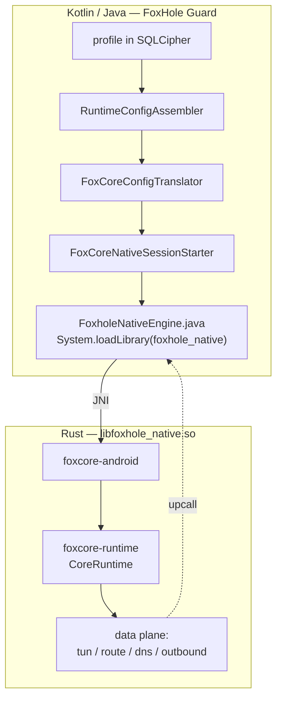
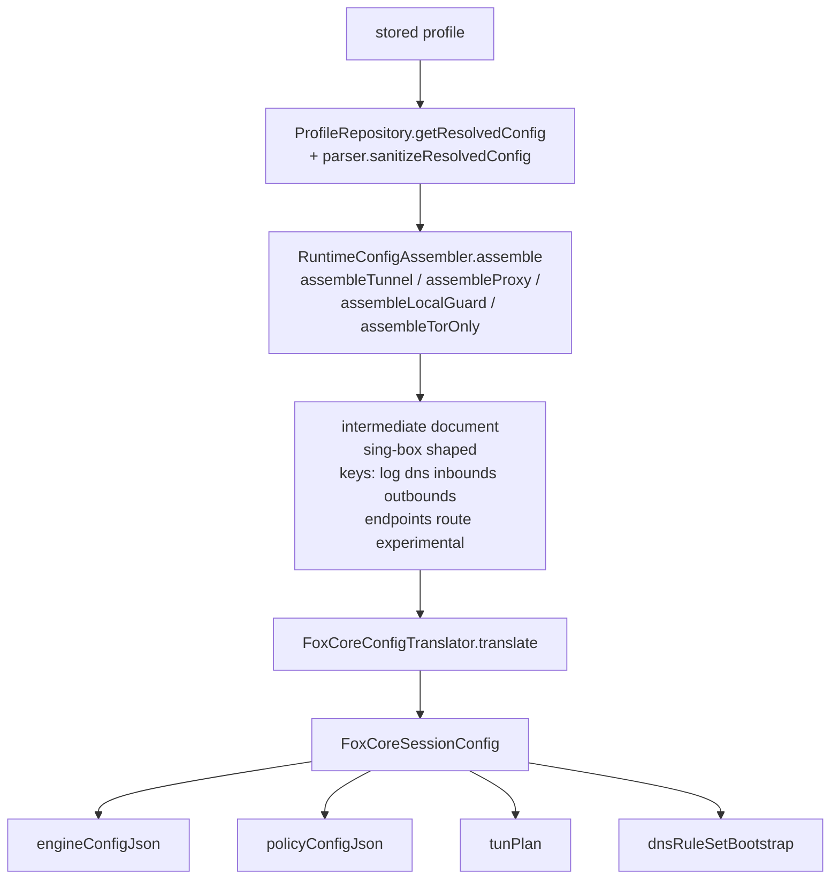
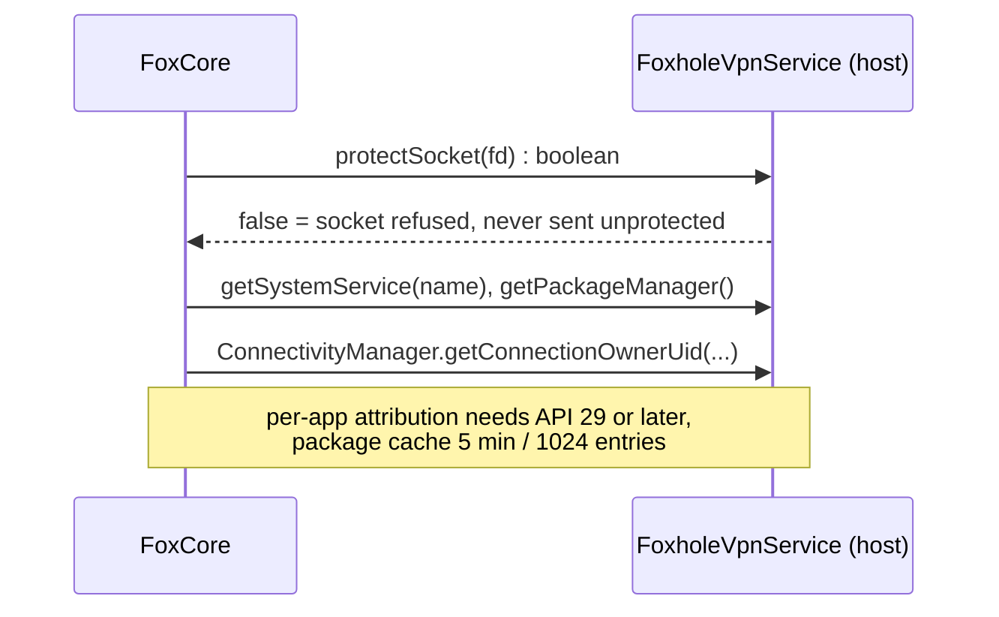
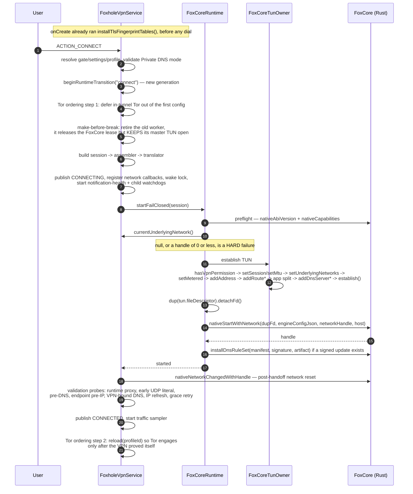
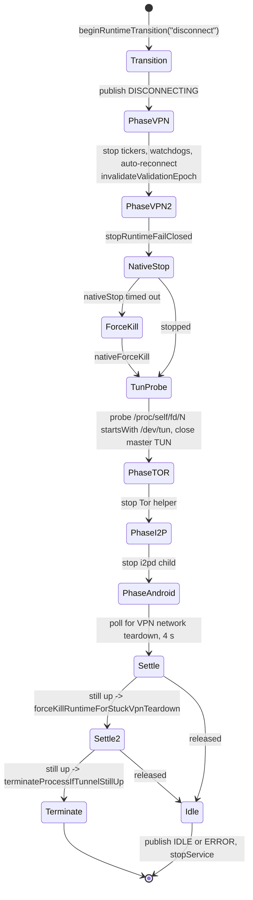
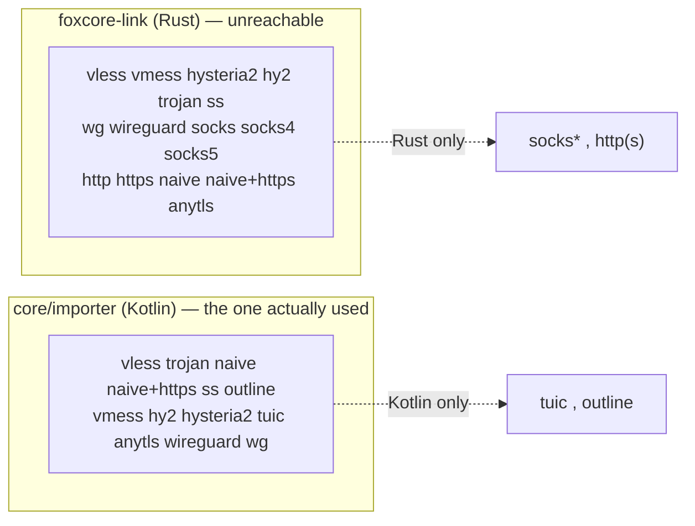

# 4. App ↔ core boundary

How a stored profile becomes a running engine, what crosses the FFI, and in what form.

---

## 4.1 The seam

| Fact | Value |
|---|---|
| Library | `libfoxhole_native.so` — `crate-type = ["cdylib"]`, lib name `foxhole_native` |
| Load site | `core/runtime/src/main/java/com/foxhole/core/runtime/FoxholeNativeEngine.java:50-52` — the only one |
| Declarations | **Java, not Kotlin**: `FoxholeNativeEngine.java:54-233` (28) and `FoxholeNativeShares.java:5-35` (9) |
| Kotlin wrapper | `interface FoxCoreNativeApi` + `object JniFoxCoreNativeApi` — `core/runtime/.../FoxCoreNativeSeam.kt:58-327` |
| ABI version | `1`, frozen; class and package name are part of the ABI |
| Serialization | **JSON everywhere**. No protobuf on the boundary. |

---

## 4.2 Profile → engine config

Two documents, two shapes. The intermediate is sing-box-like and never crosses the FFI; the engine
config is FoxCore's own schema. `log` may only carry `{level, timestamp}` and is dropped;
`experimental` must be empty (`FoxCoreConfigTranslator.kt:265-292`).

Sub-translators, all in `core/runtime/src/main/kotlin/com/foxhole/core/runtime/`:

| File | Entry | Produces |
|---|---|---|
| `FoxCoreTunTranslator.kt:11` | `translateFoxCoreTun` | `FoxCoreTunPlan` — mtu, v4/v6 + prefix, routes, advertised DNS, app include/exclude |
| `FoxCoreTunTranslator.kt:54` | `translateFoxCoreControlProxy` | `runtime.control_proxy` |
| `FoxCoreOutboundTranslator.kt:23` | `translate` | `FoxCoreOutboundPlan` — primary, named, packet-tunnel flag, overlays |
| `FoxCoreProxyOutboundTranslator.kt:8` | `translateFoxCoreProxyOutbound` | per-protocol outbound object |
| `FoxCoreWireGuardTranslator.kt:9` | `translateFoxCoreWireGuard` | `type:"wireguard"` |
| `FoxCoreTorTranslator.kt:10,62` | `translateOverlay` / `translateOutbound` | named `tor` outbound |
| `FoxCoreTlsTransportTranslator.kt:18,236` | `translateFoxCoreTls` / `translateFoxCoreTransport` | `tls` / `transport` sub-objects |
| `FoxCorePolicyTranslator.kt:30` | `translate` | dns, routes, traffic, `dns.rule_sets[]` |

Rejections are a closed enum (`FoxCoreConfigRejection`); the exception never echoes document values.

### The engine config the core accepts

`EngineConfig` — `crates/foxcore-api/src/config/engine.rs:9-30`, `deny_unknown_fields`, ≤1 MiB:

| Field | Type | Constraint |
|---|---|---|
| `schema_version` | `u32` | must equal `1` |
| `outbound` | `OutboundConfig` | the primary; addressable as `default` / legacy `primary` |
| `outbounds` | `Vec<NamedOutboundConfig>` | ≤16; `default`/`primary`/`direct`/`block` reserved |
| `tun` | `TunConfig` | `{mtu ≥ 1280, ipv4, ipv6?}` |
| `dns` | `DnsConfig` | |
| `runtime` | `RuntimeConfig` | `local_guard` ⇔ primary is `direct` |
| `routes` | `Vec<RouteRule>` | ≤4096 incl. `traffic.applications` |
| `traffic` | `TrafficPolicyConfig` | the reloadable half |

There is **no `inbounds`, no `log`, no `route`** key in `EngineConfig` — those belong to the
intermediate document only.

`PolicyConfig`, the reload document (`config/policy.rs:11-22`, ≤256 KiB):
`expected_revision?`, `dns`, `routes`, `traffic`.

---

## 4.3 What crosses, and in what form

| Item | Direction | Type | Ownership / bound |
|---|---|---|---|
| TUN fd | Java → Rust | **`jint`**, a raw int — not a `ParcelFileDescriptor` | Kotlin does `dup(...).detachFd()`; **Rust owns it on every path including failure** and Kotlin must not close it. Validated: `S_IFCHR`, `O_RDWR`, and on Android `TUNGETIFF ⇒ IFF_TUN` |
| Engine config | Java → Rust | `JString` UTF-8 JSON | ≤1 MiB, `deny_unknown_fields` |
| Policy config | Java → Rust | `JString` UTF-8 JSON | ≤256 KiB |
| Network handle | Java → Rust | `jlong` from `Network.getNetworkHandle()` | negative rejected; drives `android_setsocknetwork` / `android_getaddrinfofornetwork` |
| Host object | Java → Rust | `JObject` → `GlobalRef` | retained for the runtime's life |
| Engine handle | Rust → Java | `jlong` > 0, opaque, never reused | `0` means failure **and** a thrown exception |
| Stats | Rust → Java | `jstring` JSON `RuntimeSnapshot` | `{}` if the handle is dead |
| Traffic map | Rust → Java | `jstring` JSON | `{generation, connections[], packages[], lanes[], omitted_rows, dropped_events, dns{...}}` |
| Events | Rust → Java | `jstring` `{"events":[...],"dropped":N}` | **pull-based, bounded, drop-on-overflow.** No push callbacks into Java |
| DNS rule set | Java → Rust | `JByteArray` ×3 + name `JString` | manifest ≤64 KiB, signature ≤256 B, artifact ≤64 MiB; name ASCII ≤128 B |
| Fingerprint tables | Java → Rust | `JByteArray` | ≤4 MiB; **never throws**, returns a code |
| Errors | Rust → Java | two channels | `IllegalStateException` for lifecycle/config (message walks the whole `source()` chain); numeric codes for anything switchable |
| **Logs** | — | **none** | There is no Java log callback. Rust writes to logcat directly (tag `FoxCore`), capped at `warn` because debug/trace records interpolate `NetworkTuple` — the user's connection list |

### Upcalls (Rust → Java)

Host contract: `RuntimeServiceHost` — `core/runtime/.../RuntimeNativeSupport.kt:12-32`;
implementation `FoxholeVpnService.kt:488-497`.

Panic containment: every JNI entry is wrapped in `catch_unwind(AssertUnwindSafe(...))`; a contained
panic becomes `IllegalStateException("panic inside FoxCore JNI boundary")` or a `-1`-family code.

---

## 4.4 JNI surface

### C ABI (4 symbols)

| Symbol | Signature | Purpose |
|---|---|---|
| `foxhole_core_abi_version` | `() -> u32` | `1` |
| `foxhole_core_config_schema_version` | `() -> u32` | `1` |
| `foxhole_core_capabilities_json_len` | `() -> usize` | length including NUL |
| `foxhole_core_capabilities_json_write` | `(*mut u8, usize) -> usize` | NULL/short buffer left untouched, returns required size |

Header: `crates/foxcore-android/include/foxhole_core.h`.

### `FoxholeNativeEngine` — 33 Rust exports

Key signatures:

| Function | Java signature | Returns |
|---|---|---|
| `nativeStartWithNetwork` | `(ILjava/lang/String;JLjava/lang/Object;)J` | handle > 0, or `0` + `IllegalStateException` |
| `nativeStartWithNetworkAndTrustedDnsRuleSet` | `(ILjava/lang/String;JLjava/lang/String;[BLjava/lang/Object;)J` | APK-trusted artifact, no signature check |
| `nativeInstallDnsRuleSet` | `(JLjava/lang/String;[B[B[B)J` | revision, or `0` + throw |
| `nativeInstallTlsFingerprintTables` | `([B)I` | profiles replaced, or `-1` unreadable / `-2` refused / `-3` panic |
| `nativeStop` / `nativeForceKill` | `(J)I` | `0` stopped, `1` already, `2` timed out, `3` unknown handle, `-1` panic |
| `nativeReloadPolicy` | `(JLjava/lang/String;)J` | > 0 revision, `0` not running, `-1..-9` refusal |
| `nativeRevokeFlows` | `(JLjava/lang/String;)I` | count ≥ 0, or `-1` panic / `-2` no engine / `-3` bad target. Target JSON tagged on `kind`: `all\|lane\|uid\|package\|outbound\|flow` |
| `nativeLastStopDiagnostics` | `()Ljava/lang/String;` | **no handle** — the caller has just been told its stop timed out. `{phase, engine_ms, shutdown_ms, generation}` |

Two further JNI classes: `FoxholeNativeShares` (10 Rust exports, file sharing — in development) and
`FoxholeNativeComponents` (9 Rust exports, web apps and leases). See [4.7](#47-abi-gaps).

---

## 4.5 Connect sequence

**The real order is: host registered by construction → establish TUN (Android) → dup fd → start
engine.** `protect()` is never called before the engine exists — it is a Rust→Java upcall made per
outbound socket.

---

## 4.6 Disconnect sequence

The last resort kills the process so Android revokes every descriptor, including FoxCore's dup.
This is the self-kill path recorded in the teardown notes.

### States

| Layer | Enum | Values |
|---|---|---|
| UI / bridge | `ConnectionState` | `IDLE, CONNECTING, CONNECTED, RECONNECTING, DISCONNECTING, ERROR` |
| Teardown phase | `RuntimeTeardownPhase` | `VPN, TOR, I2P, ANDROID_TUNNEL` |
| Native FSM | `RuntimeState` | `IDLE, PREPARING, STARTING, VALIDATING, RUNNING, RELOADING, STOPPING, KILLING, RESTARTING, ERROR` |
| Supervisor | `RuntimePhase` | `Idle, Preparing, StartingNative, WaitingVpnNetwork, ValidatingTunnel, Connected, Reconnecting, Reloading, Stopping, Killing, Error` |

### Watchdogs

| Watchdog | Behaviour |
|---|---|
| Notification connectivity health | 1 s probe; 3 consecutive failures ⇒ reconnect |
| Child process (i2pd) | event-first via `setUnexpectedExitListener`, slow poll fallback; a child that ran and is later killed ⇒ **full runtime rebuild**, fail-closed |
| Stop / teardown | the 3-stage escalation above |
| Session ticker | one timer, tasks: `traffic`, `app_traffic`, `dns_guard_window`, `notification_health`, `child_watchdog`, `lan_proxy`, `i2p_traffic` |
| Local guard heal | bounded self-heal; deliberately survives an error teardown |
| Native stop reaper (Rust) | 40 attempts × `STOP_TIMEOUT` |

`CoreRuntime::start` acquires a **process-wide worker lease** — only one data-plane worker per
process (`crates/foxcore-runtime/src/start.rs:115-116`).

---

## 4.7 ABI gaps

Rust exports with no counterpart in this client — verified by grep across `foxhole_guard_dev`:

| Export | Status |
|---|---|
| `nativeStart` | no Java declaration (the app always passes a network handle) |
| `nativeTrafficMap` | no Java declaration; the app uses the `nativeConnections` alias, which returns the **same document** |
| `nativeImportLink`, `nativeImportSubscription` | no Java declaration, **zero call sites**. The whole `foxcore-link` crate is unreachable from the app |
| all nine `FoxholeNativeComponents_*` | **no `FoxholeNativeComponents` class exists.** Web-app / lease / component-event ABI is unusable from this client |
| `nativeExportFile` | not declared in `FoxholeNativeShares.java` |
| `nativeStartWithNetworkAndDnsRuleSet` | declared at `FoxholeNativeEngine.java:84` but never wired — `FoxCoreNativeApi` has no such method; signed updates go through `installDnsRuleSet` after start |

### Two link parsers, two answers

`foxcore-link/src/lib.rs:3-7` states the crate exists so the app does not have to carry a second
parser. The app carries one anyway, and the two disagree on four schemes.

### Other drift

| Finding | Detail |
|---|---|
| **Reload code `-9` is unhandled** | `PolicyRefusal::PacketTunnelRejectsPrimaryDns = 9` (`crates/foxcore-runtime/src/state.rs:333`) means `nativeReloadPolicy` can return `-9`. `FoxholeNativeEngine.java` defines constants only to `-8` and `reloadCode()` falls through to `"unknown_code=-9"`. The Rust doc comment at `lib.rs:703-714` is itself stale — it lists `-1..-7` and says "eight codes". `docs/abi.md:189` has it right. |
| `docs/abi.md:48` overstated | "string-returning calls return `null` only for a panic path" is contradicted by `link.rs:39-46` (null **and** a thrown exception on any `Err`) and by the `new_string` allocation-failure arms in `lib.rs` |
| `FoxholeNativeShares.java` has no loader | no `System.loadLibrary` block; it relies on `FoxholeNativeEngine` being class-initialized first. In practice `FoxCoreShareRuntime.attach` runs after a native start, so the order holds — but it is an implicit dependency, not an enforced one |
| Stale `libTor.so` comment | `core/runtime/.../I2pdRuntimeInstaller.kt:19` says i2pd ships "as a jniLib exactly like `libTor.so`". No such library exists; `TorRuntimeInstallerDeviceTest.kt:36` asserts it does **not**, and `TorRuntimeInstaller.kt:12-17` says there is no Tor executable at all |
