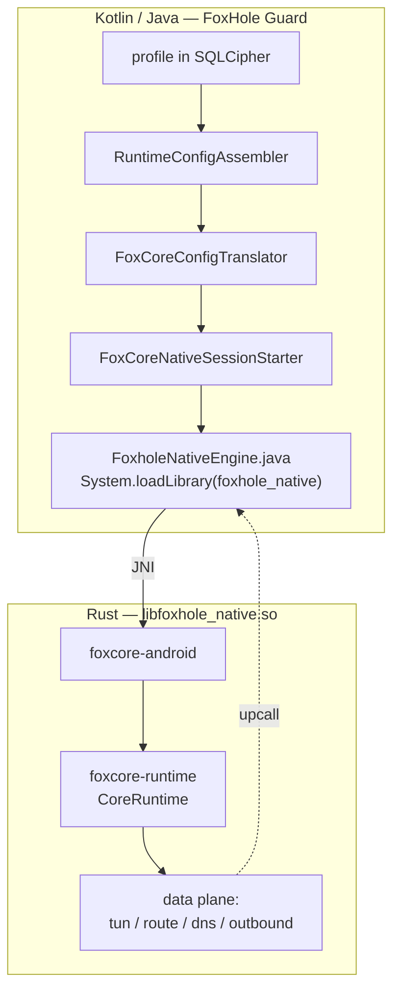
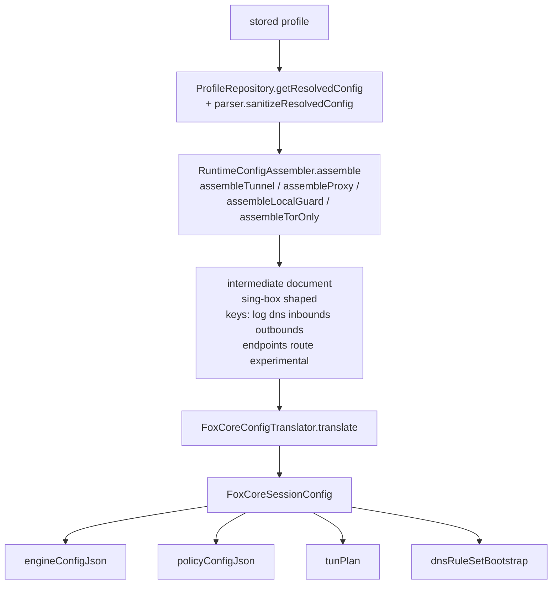
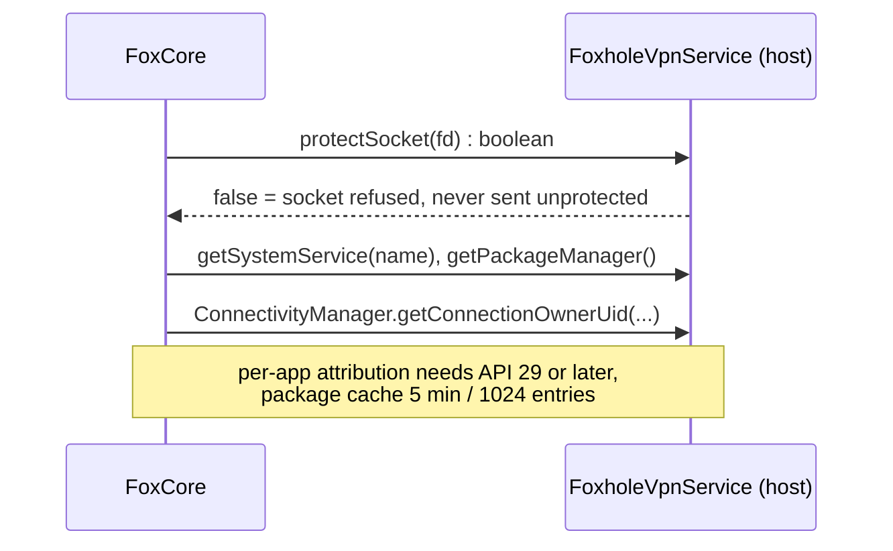
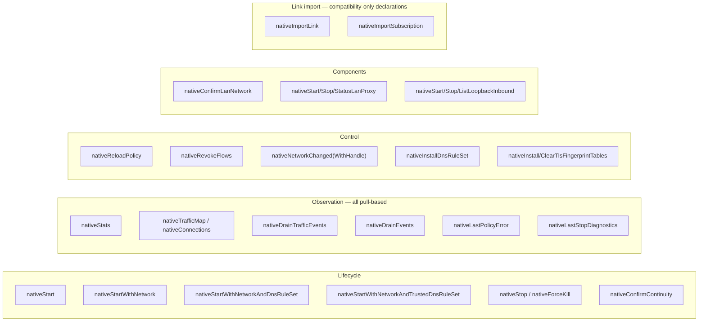
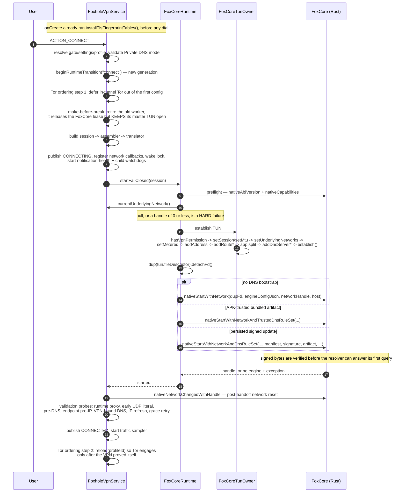
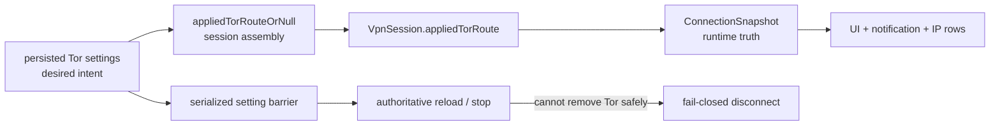
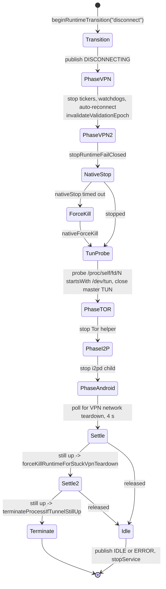
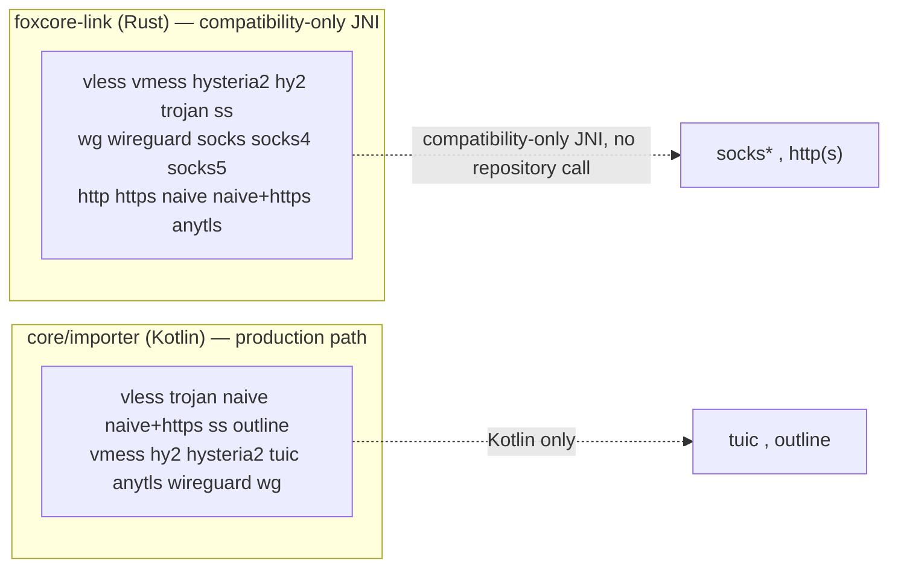

# 4. App ↔ core boundary

How a stored profile becomes a running engine, what crosses the FFI, and in what form.

---

## 4.1 The seam

| Fact | Value |
|---|---|
| Library | `libfoxhole_native.so` — `crate-type = ["cdylib"]`, lib name `foxhole_native` |
| Load site | `core/runtime/src/main/java/com/foxhole/core/runtime/FoxholeNativeEngine.java:51-53` — the only one |
| Shipped Engine seam | **33 Rust exports / 32 Java declarations** (`FoxholeNativeEngine.java:55-227`). Only legacy `nativeStart`, which has no Android `Network` handle, is intentionally absent from Java. |
| Kotlin wrapper | `interface FoxCoreNativeApi` + `object JniFoxCoreNativeApi` expose the product-reachable subset; link import and continuity stop at Java compatibility declarations |
| Cross-repository gate | The app compares every shipped Engine export with Java declarations and production Kotlin references (`scripts/verify-foxcore-jni-seam.sh`), then executes product-reachable calls against the packaged `.so` on Android (`FoxCoreNativeSeamAndroidTest.kt`). |
| Core release version | `0.0.5` comes from the workspace package (`Cargo.toml:36-41`). `CORE_VERSION` is `CARGO_PKG_VERSION` (`crates/foxcore-api/src/lib.rs:38-40`) and supplies both JNI `nativeVersion` (`crates/foxcore-android/src/lib.rs:105-115`) and capabilities JSON (`crates/foxcore-android/src/capabilities.rs:699-707`). |
| ABI version | `1`, frozen; class and package name are part of the ABI |
| Structured documents | JSON, with no protobuf. TUN/network handles and signed DNS/fingerprint payloads use their native scalar/byte-array forms. |
| Build-path contract | `scripts/android-build.sh:67-98` remaps the checkout, Cargo home and Rustup home before compiling. The ELF gate refuses build-host paths (`scripts/android-elf-gate.sh:138-166,222-225`), and the release reproducibility check compares bytes from different checkout and Cargo-home paths (`scripts/reproducible-build.sh:46-150`). |
| Release provenance | release verifies the main commit against a reviewed OpenPGP signing-subkey/primary-key pair (`scripts/verify-release-signature.py:15`), then requires successful dev CI evidence for the identical Git tree completed within 24 hours (`.github/workflows/release.yml:53`). It rebuilds and verifies JNI, both ARM ABIs, manifest and SBOM; `RELEASE.json` records the commits, shared tree and gate run. SHA-256 and keyless attestation cover the archive. |

### Release trust and rotation

`config/release-signers.asc:1` contains public keys only;
`config/release-signing-fingerprints.txt:1` pins both the signing subkey and its primary key.
The verifier uses an isolated GnuPG home and requires one valid signature from an allowed pair.
GitHub's generic Verified flag or an unrelated trusted key cannot satisfy it. This proves key
identity, not whether a particular signing operation happened on hardware
(`scripts/verify-release-signature.py:15`).

For rotation, the owner reviews and signs the addition of the replacement public key and complete
fingerprint pair while the existing trust is still valid. After that change is accepted, release
commits can use the new key; removal of the old pair is a separate owner-reviewed change. A lost
or compromised sole trusted key requires an explicit out-of-band owner trust decision. Neither
key material nor trust configuration is downloaded by the release job.

The dev gate fetches fresh advisory data, and the daily advisory workflow checks the current dev
lockfile for both dependency graphs (`.github/workflows/ci.yml:133`;
`.github/workflows/advisories.yml:1`). These files do not enforce GitHub branch/tag protection or
immutable releases: repository settings must separately require the gate, protect signed main
updates, prevent tag rewrites/deletion, and limit bypass to the owner's approved release path.

### Loopback authentication in 0.0.5

An inbound requires either complete credentials or explicit `allow_anonymous: true`; omission,
partial credentials, and mixing credentials with anonymous mode are rejected
(`crates/foxcore-api/src/config/rt.rs:136,162`). Capabilities expose `mandatory_credentials: false` and
`anonymous_requires_explicit_opt_in: true` for loopback listeners; LAN proxy credentials remain
mandatory (`crates/foxcore-android/src/capabilities.rs:1173`). Runtime status reports `authentication` as
`credentials` or `anonymous` (`crates/foxcore-runtime/src/snapshot.rs:127`). Anonymous listeners are
reachable by other apps on the device. Guard sets consent only when the user explicitly disables
proxy authentication; a missing password never creates it (`foxhole_guard/core/runtime/src/main/kotlin/com/foxhole/core/runtime/LocalProxyRuntime.kt:24`).

The new optional field retains config schema and ABI v1, but legacy anonymous payloads now fail
validation. Ship Core 0.0.5 before a Guard release that sends the field, then update Guard's exact
revision pin; a client still built against 0.0.4 cannot use this new request contract.

---

## 4.2 Profile → engine config

Two documents, two shapes. The intermediate is sing-box-like and never crosses the FFI; the engine
config is FoxCore's own schema. `log` may only carry `{level, timestamp}` and is dropped;
`experimental` must be empty (`FoxCoreConfigTranslator.kt:260-289`).

Sub-translators, all in `core/runtime/src/main/kotlin/com/foxhole/core/runtime/`:

| File | Entry | Produces |
|---|---|---|
| `FoxCoreTunTranslator.kt:11` | `translateFoxCoreTun` | `FoxCoreTunPlan` — mtu, v4/v6 + prefix, routes, advertised DNS, app include/exclude |
| `FoxCoreTunTranslator.kt:54` | `translateFoxCoreControlProxy` | `runtime.control_proxy` |
| `FoxCoreOutboundTranslator.kt:23` | `translate` | `FoxCoreOutboundPlan` — primary, named, packet-tunnel flag, overlays |
| `FoxCoreProxyOutboundTranslator.kt:8` | `translateFoxCoreProxyOutbound` | per-protocol outbound object |
| `FoxCoreWireGuardTranslator.kt:26` | `translateFoxCoreWireGuard` | `type:"wireguard"` |
| `FoxCoreTorTranslator.kt:13,65` | `translateOverlay` / `translateOutbound` | named `tor` outbound |
| `FoxCoreTlsTransportTranslator.kt:18,211` | `translateFoxCoreTls` / `translateFoxCoreTransport` | `tls` / `transport` sub-objects |
| `FoxCorePolicyTranslator.kt:30` | `translate` | dns, routes, traffic, `dns.rule_sets[]` |

Rejections are a closed enum (`FoxCoreConfigRejection`); the exception never echoes document values.

Tor bridge policy is resolved before translation. `AUTO` selects one Snowflake group; explicit
transports cannot cross-fallback, while downloaded-to-bundled fallback is allowed only for that
same transport (`core/runtime/src/main/kotlin/com/foxhole/core/runtime/TorBridgeTorrcLines.kt:50-81`).
The runtime derives the required protocol tokens from the resulting bridge lines, narrows and
coalesces the PT process declarations, and fails preflight if any selected protocol has no helper
(`core/runtime/src/main/kotlin/com/foxhole/core/runtime/TorRuntimeInstaller.kt:169-198,274-305`).
The translator therefore receives only the selected `bridges` and `pluggable_transports`, validates
their shape, and emits those values without reopening transport selection
(`core/runtime/src/main/kotlin/com/foxhole/core/runtime/FoxCoreTorTranslator.kt:65-125,163-193`).

### The engine config the core accepts

`EngineConfig` — `crates/foxcore-api/src/config/engine.rs:9-30`, `deny_unknown_fields`, ≤1 MiB:

| Field | Type | Constraint |
|---|---|---|
| `schema_version` | `u32` | must equal `1` |
| `outbound` | `OutboundConfig` | the primary; addressable as `default` / legacy `primary` |
| `outbounds` | `Vec<NamedOutboundConfig>` | ≤16; `default`/`primary`/`direct`/`block` reserved |
| `tun` | `TunConfig` | `{mtu ≥ 1280, ipv4, ipv6?}` |
| `dns` | `DnsConfig` | |
| `runtime` | `RuntimeConfig` | `local_guard` ⇔ primary is `direct` |
| `routes` | `Vec<RouteRule>` | ≤4096 incl. `traffic.applications` |
| `traffic` | `TrafficPolicyConfig` | the reloadable half |

There is **no `inbounds`, no `log`, no `route`** key in `EngineConfig` — those belong to the
intermediate document only.

`PolicyConfig`, the reload document (`config/policy.rs:11-22`, ≤256 KiB):
`expected_revision?`, `dns`, `routes`, `traffic`.

---

## 4.3 What crosses, and in what form

| Item | Direction | Type | Ownership / bound |
|---|---|---|---|
| TUN fd | Java → Rust | **`jint`**, a raw int — not a `ParcelFileDescriptor` | Kotlin does `dup(...).detachFd()`; **Rust owns it on every path including failure** and Kotlin must not close it. Validated: `S_IFCHR`, `O_RDWR`, and on Android `TUNGETIFF ⇒ IFF_TUN` |
| Engine config | Java → Rust | `JString` UTF-8 JSON | ≤1 MiB, `deny_unknown_fields` |
| Policy config | Java → Rust | `JString` UTF-8 JSON | ≤256 KiB |
| Network handle | Java → Rust | `jlong` from `Network.getNetworkHandle()` | negative rejected; drives `android_setsocknetwork` / `android_getaddrinfofornetwork` |
| Host object | Java → Rust | `JObject` → `GlobalRef` | retained for the runtime's life |
| Engine handle | Rust → Java | `jlong` > 0, opaque, never reused | `0` means failure **and** a thrown exception |
| Stats | Rust → Java | `jstring` JSON `RuntimeSnapshot` | `{}` if the handle is dead |
| Traffic map | Rust → Java | `jstring` JSON | `{generation, connections[], packages[], lanes[], omitted_rows, dropped_events, dns{...}}` |
| Events | Rust → Java | `jstring` `{"events":[...],"dropped":N}` | **pull-based, bounded, drop-on-overflow.** No push callbacks into Java |
| DNS rule set | Java → Rust | `JByteArray` ×3 + name `JString` | manifest ≤64 KiB, signature ≤256 B, artifact ≤64 MiB; name ASCII ≤128 B |
| Fingerprint tables | Java → Rust | `JByteArray` | ≤4 MiB; **never throws**, returns a code |
| Errors | Rust → Java | two channels | `IllegalStateException` for lifecycle/config (message walks the whole `source()` chain); numeric codes for anything switchable |
| **Logs** | — | **none** | There is no Java log callback. Rust writes to logcat directly (tag `FoxCore`), capped at `warn` because debug/trace records interpolate `NetworkTuple` — the user's connection list |

### Upcalls (Rust → Java)

Host contract: `RuntimeServiceHost` —
`core/runtime/src/main/kotlin/com/foxhole/core/runtime/RuntimeNativeSupport.kt:12-34`; implementation
`app/src/main/kotlin/com/foxhole/guard/runtime/FoxholeVpnService.kt:67,485-504`.

Panic containment: every JNI entry is wrapped in `catch_unwind(AssertUnwindSafe(...))`; a contained
panic becomes `IllegalStateException("panic inside FoxCore JNI boundary")` or a `-1`-family code.

---

## 4.4 JNI surface

### C ABI (4 symbols)

| Symbol | Signature | Purpose |
|---|---|---|
| `foxhole_core_abi_version` | `() -> u32` | `1` |
| `foxhole_core_config_schema_version` | `() -> u32` | `1` |
| `foxhole_core_capabilities_json_len` | `() -> usize` | length including NUL |
| `foxhole_core_capabilities_json_write` | `(*mut u8, usize) -> usize` | NULL/short buffer left untouched, returns required size |

Header: `crates/foxcore-android/include/foxhole_core.h`.

### `FoxholeNativeEngine` — 33 Rust exports

Key signatures:

| Function | Java signature | Returns |
|---|---|---|
| `nativeStartWithNetwork` | `(ILjava/lang/String;JLjava/lang/Object;)J` | handle > 0, or `0` + `IllegalStateException` |
| `nativeStartWithNetworkAndDnsRuleSet` | `(ILjava/lang/String;JLjava/lang/String;[B[B[BLjava/lang/Object;)J` | atomic signed bootstrap: handle > 0, or no engine + throw |
| `nativeStartWithNetworkAndTrustedDnsRuleSet` | `(ILjava/lang/String;JLjava/lang/String;[BLjava/lang/Object;)J` | APK-trusted artifact, no signature check |
| `nativeInstallDnsRuleSet` | `(JLjava/lang/String;[B[B[B)J` | revision, or `0` + throw |
| `nativeTrafficMap` | `(J)Ljava/lang/String;` | canonical bounded traffic-map document |
| `nativeConfirmContinuity` | `(JJ)I` | typed `0..3` result, or `-1` panic |
| `nativeInstallTlsFingerprintTables` | `([B)I` | profiles replaced, or `-1` unreadable / `-2` refused / `-3` panic |
| `nativeStop` / `nativeForceKill` | `(J)I` | `0` stopped, `1` already, `2` timed out, `3` unknown handle, `-1` panic |
| `nativeReloadPolicy` | `(JLjava/lang/String;)J` | > 0 revision, `0` not running, `-1..-9` refusal |
| `nativeRevokeFlows` | `(JLjava/lang/String;)I` | count ≥ 0, or `-1` panic / `-2` no engine / `-3` bad target. Target JSON tagged on `kind`: `all\|lane\|uid\|package\|outbound\|flow` |
| `nativeLastStopDiagnostics` | `()Ljava/lang/String;` | **no handle** — the caller has just been told its stop timed out. `{phase, engine_ms, shutdown_ms, generation}` |

Release libraries also retain 19 component/share exports: ten `FoxholeNativeShares_*` and nine
`FoxholeNativeComponents_*`. v0.0.1 shipped them, and the frozen ABI-v1 fixture requires them
(`fixtures/abi/v1/exports.txt:1-19`; `scripts/abi-gate.sh:1-17`). The app has a nine-method Shares
facade but no production call site, and no Components facade. These symbols are outside the 33/32
Engine seam and remain solely for ABI compatibility.

---

## 4.5 Connect sequence

**The real order is: host registered by construction → establish TUN (Android) → dup fd → start
engine.** `protect()` is never called before the engine exists — it is a Rust→Java upcall made per
outbound socket.

Direct bridged Tor-only validation is one authenticated runtime-proxy request with an 80 s call cap
inside one monotonic 120 s validation deadline; 5 s is reserved for a classification-only control
probe after a strict failure (`RuntimeValidationProbePlan.kt:139-175`;
`RuntimeValidationRun.kt:331-360`; `RuntimeProxyEgressValidationSupport.kt:84-146,350-388`). The
core assigns that Tor CONNECT route 75 s to build its upstream while VPN and direct routes retain
30 s. The accepted session still owns a bounded permit, and listener cancellation races the whole
serve future, so stop does not wait for either connect ceiling
(`crates/foxcore-component/src/lan.rs:114-121,286-291,821-830,927-939,963-988`).

### Policy publication during a network handoff

`ActiveFoxCoreSession.sessionIdentity` remains stable when network metadata is copied
(`core/runtime/src/main/kotlin/com/foxhole/core/runtime/FoxCoreNativeSeam.kt:338`). Reload admission
checks that identity and its transition generation. Publication holds `stateLock` and retains the
latest network handle, so a successful native policy update cannot be discarded solely because a
network callback copied the session (`FoxCoreRuntime.kt:392,684,774`). A stopped or replaced
session cannot acquire ownership through a late completion. Native policy reload, DNS installation,
and network changes are serialized by Core's policy writer (`crates/foxcore-tun/src/flow/policy.rs:117`).

### Authorized profile commands and WebApp ownership

Notification actions carry a private, app-issued request bound to profile and protocol option,
with a ten-minute monotonic expiry and boot identity. The UI admits commands after App Lock and
consumes the request once before executing it. A caller-supplied profile ID alone cannot authorize
a switch (`app/src/main/kotlin/com/foxhole/guard/runtime/NetworkRuleCommandRequests.kt:8,25,38`;
`app/src/main/kotlin/com/foxhole/guard/ui/HomeViewModelNetworkRulesSupport.kt:204`).

WebApp foreground state binds the app and a proxy lease generation. Under the polling mutex, the
watchdog blocks and destroys the old view before changing the process-wide proxy; a late release
only applies to its own lease. Failed proxy cleanup keeps polling suspended
(`app/src/main/kotlin/com/foxhole/guard/core/webapps/WebAppsWatchdog.kt:194,224,237`). On WebView implementations supporting multiple profiles, named storage
profiles are required before loading a page, and the installed profile name is checked. There is no
fallback to shared storage after installation failure (`WebAppProfiles.kt:24`). Pending data
removals persist before the database row is removed and are retried before a later profile load;
a failed removal retains its record (`WebAppsDataCleaner.kt:29,38`; `WebAppProfiles.kt:29`).

### Desired Tor intent vs applied runtime

The persisted privacy-route block is intent, not proof that Tor is carrying traffic. Revoking
permission atomically clears the desired mode and enable timestamp
(`app/src/main/kotlin/com/foxhole/guard/core/settings/SettingsRepositoryPrivacyRoute.kt:36-63`).
Session assembly resolves that intent into an
`AppliedTorRoute` only when permission, mode, transport and scope are compatible
(`core/runtime/src/main/kotlin/com/foxhole/core/runtime/RuntimeRouteConfig.kt:189-213`), stores it in
the exact `VpnSession` being built
(`app/src/main/kotlin/com/foxhole/guard/core/data/ProfileSessionFactory.kt:135-144`), and publishes it
with the connection snapshot (`core/model/src/main/kotlin/com/foxhole/core/model/Models.kt:171-190,378-394`).
Dashboard identity, Tor IP and notification route labels consume this applied descriptor rather
than rereading settings (`app/src/main/kotlin/com/foxhole/guard/ui/HomeStateProducer.kt:432-438`;
`app/src/main/kotlin/com/foxhole/guard/runtime/FoxholeVpnServiceRuntimePolicies.kt:96-125`).

Runtime-affecting writes are serialized. An authoritative Tor change commits the setting, then
dispatches reload or stop even if an older reconnect warning is pending; cancellation cannot split
those two synchronous steps
(`app/src/main/kotlin/com/foxhole/guard/ui/HomeViewModelRuntimeSupport.kt:116-218`). If the
replacement session cannot be built while its desired Tor route differs from the active one, the
service tears the runtime down instead of keeping stale Tor live
(`app/src/main/kotlin/com/foxhole/guard/runtime/FoxholeVpnServiceReloadSupport.kt:350-449`). VPN+Tor
stop/mode choices revalidate the applied descriptor before acting; the Tor-only handoff disconnects
VPN before starting the standalone session, so interruption leaves the device disconnected rather
than on the old route
(`app/src/main/kotlin/com/foxhole/guard/ui/HomeViewModelVpnTorTransitionSupport.kt:15-115`).

---

## 4.6 Disconnect sequence

The last resort kills the process so Android revokes every descriptor, including FoxCore's dup.
This is the self-kill path recorded in the teardown notes.

The Kotlin JNI fence lets `nativeStop` use the full graceful budget plus a 750 ms return-settlement
margin (`FoxCoreNativeEngineOperations.kt:92-100`; `RuntimeStopSupport.kt:20-23,560-568`). With the
production 3,000 ms policy, the native call therefore has 3,750 ms; its outer fail-closed supervisor
has 5,750 ms, covering that complete window, the 1,500 ms `nativeForceKill` fence and 500 ms of
scheduling overhead (`RuntimeStopSupport.kt:513-550`). Timeout arithmetic saturates at `Long.MAX_VALUE`
instead of wrapping to an immediate timeout.

### States

| Layer | Enum | Values |
|---|---|---|
| UI / bridge | `ConnectionState` | `IDLE, CONNECTING, CONNECTED, RECONNECTING, DISCONNECTING, ERROR` |
| Teardown phase | `RuntimeTeardownPhase` | `VPN, TOR, I2P, ANDROID_TUNNEL` |
| Native FSM | `RuntimeState` | `IDLE, PREPARING, STARTING, VALIDATING, RUNNING, RELOADING, STOPPING, KILLING, RESTARTING, ERROR` |
| Supervisor | `RuntimePhase` | `Idle, Preparing, StartingNative, WaitingVpnNetwork, ValidatingTunnel, Connected, Reconnecting, Reloading, Stopping, Killing, Error` |

### Watchdogs

| Watchdog | Behaviour |
|---|---|
| Notification connectivity health | 1 s probe; 3 consecutive failures ⇒ reconnect |
| Child process (i2pd) | event-first via `setUnexpectedExitListener`, slow poll fallback; a child that ran and is later killed ⇒ **full runtime rebuild**, fail-closed |
| Stop / teardown | the 3-stage escalation above |
| Session ticker | one timer, tasks: `traffic`, `app_traffic`, `dns_guard_window`, `notification_health`, `child_watchdog`, `lan_proxy`, `i2p_traffic` |
| Local guard heal | bounded self-heal; deliberately survives an error teardown |
| Native stop reaper (Rust) | 40 attempts × `STOP_TIMEOUT` |

`CoreRuntime::start` acquires a **process-wide worker lease** — only one data-plane worker per
process (`crates/foxcore-runtime/src/start.rs:119-120`).

---

## 4.7 Reachability and remaining gaps

The release surface and the product call graph are different questions:

| Surface | Boundary status | Product reachability |
|---|---|---|
| Engine lifecycle | 33 Rust exports, 32 Java declarations | Complete by design: only legacy `nativeStart` is omitted; every production start passes an Android `Network` handle. |
| Signed DNS bootstrap | Java declaration, `FoxCoreNativeApi` methods and JNI calls are present (`FoxCoreNativeSeam.kt:73-99,219-270`); start dispatch is at `FoxCoreNativeSessionStarter.kt:252-283` | A persisted signed update is verified as part of `nativeStartWithNetworkAndDnsRuleSet`, before the engine is published; the same boundary also supports generation-fenced live signed install. |
| Traffic map | `nativeTrafficMap` is declared and called by `JniFoxCoreNativeApi` (`FoxCoreNativeSeam.kt:284-288`) | `FoxCoreRuntime.runtimeTrafficMapJson` uses the canonical call (`FoxCoreRuntime.kt:714-717`); `nativeConnections` remains a compatibility alias. |
| Link import | The two Rust exports and Java declarations are retained as compatibility-only ABI and classified by `verify-foxcore-jni-seam.sh` | **No Kotlin product wrapper or importer/data-layer call site.** `ProfileImportParser` remains the app's parser. The native DTO is not a drop-in replacement for the app's normalized profile contract. |
| Continuity | The Rust export and Java declaration are retained as compatibility-only ABI | Audit events are parsed and journalled, but the translator keeps automatic continuity defaults and no service/UI action exposes a confirmation token. |
| Live DNS install | `nativeInstallDnsRuleSet` is called through a generation-fenced runtime method after the exact verified bytes are persisted | A stable engine with the same trust adopts the update live and commits the returned revision. Enable or trust rotation changes the immutable fingerprint and uses signed replacement start; no active engine defers to the next start. |
| Native Rust build paths | Release compilation remaps checkout, Cargo-home and Rustup-home variants; the ELF gate rejects detected host roots (`scripts/android-build.sh:67-98`; `scripts/android-elf-gate.sh:138-166,222-225`) | The release proof builds from a second checkout and Cargo home, requires byte-identical `.so` files, and checks both for path leaks (`scripts/reproducible-build.sh:46-150`). The Rust library requires no fixed builder directory. |
| Component/share JNI | 19 exports are frozen in ABI v1 and remain in release ELF files | Guard has no product call site. They do not count toward the separate 33/32 Engine seam. |

### Two link parsers, two answers

`foxcore-link/src/lib.rs:636-650` exposes the partial subscription import intended for applications.
The JNI exports remain frozen, but the repository calls the Kotlin parser and the two disagree on
four schemes. A product switch requires a shared DTO and policy/secret-handling corpus first.

---

## 4.8 Inconsistencies found

The app's direct bridged-Tor proof budget had outgrown the core component's route-agnostic 30 s
CONNECT ceiling, so the authenticated loopback proxy could return `502` before a fresh managed-
bridge circuit was usable. FoxCore 0.0.4 makes only that internal policy route-aware (Tor 75 s,
VPN/direct 30 s); ABI v1, configuration schema v1 and capabilities schema v1 are unchanged
(`Cargo.toml:36-41`; `crates/foxcore-component/src/lan.rs:114-121,286-291`;
`docs/abi.md:7-17`).

Core 0.0.5 and Guard 0.1.1 repair the separate native policy-writer and Kotlin session-copy races.
The loopback capability document previously claimed mandatory credentials while configuration
could enable anonymous access. It now reports the explicit opt-in requirement and preserves the
LAN credential requirement (`crates/foxcore-android/src/capabilities.rs:1173`). GitHub branch/tag
settings remain an owner-controlled prerequisite, independent of the checked-in signer gate.
