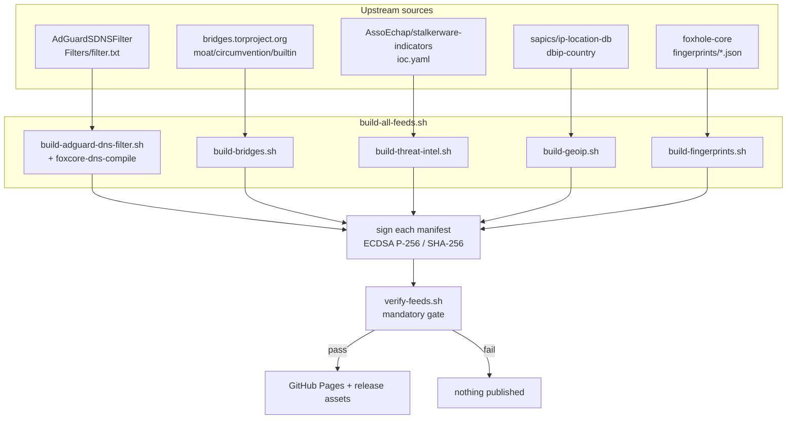
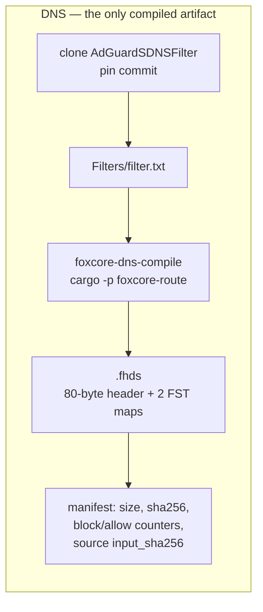
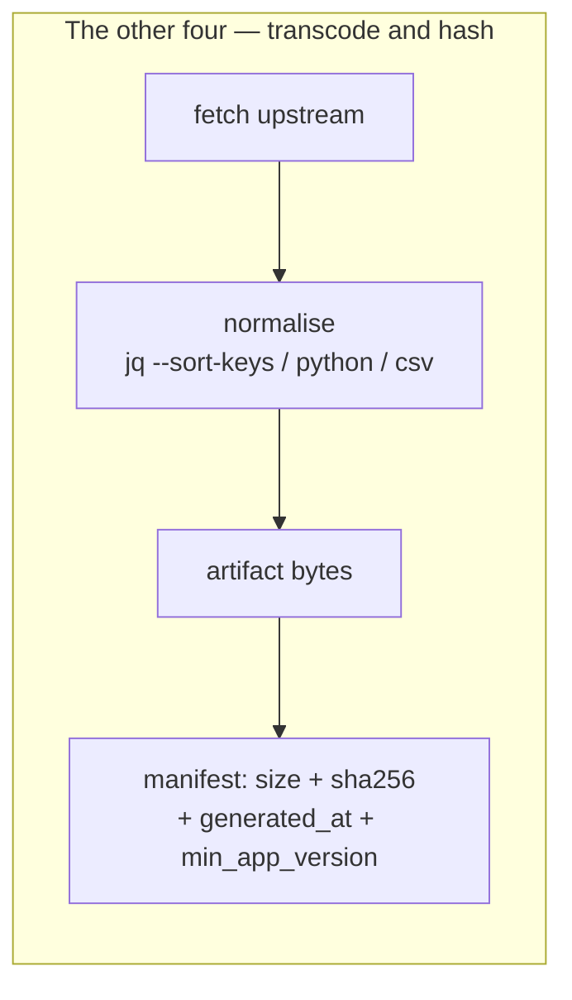
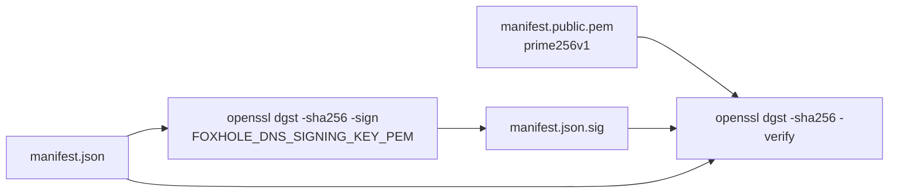
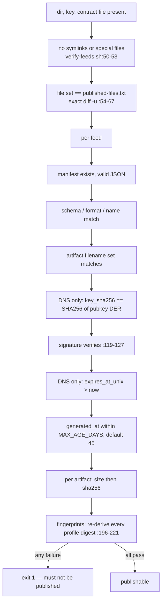

# 5. Data repository — FoxHole DB

Repo: `foxhole-team/foxhole-db` (public).
Five independent feeds, one signing key, one publication set.

---

## 5.1 Build model

One scheduled GitHub Actions job builds the feeds together and publishes them as one set. Four are
published today; the fifth, TLS fingerprint tables, is built and gated but withheld until the core
revision it mirrors is public.

`build-all-feeds.sh:14-18` always ends with `verify-feeds.sh`. CI runs the same gate at
`.github/workflows/feeds.yml:159`, after signing and before the Pages deploy.

---

## 5.2 Feeds

| Feed | Artifact | Format | Built by | Upstream | Client consumer |
|---|---|---|---|---|---|
| DNS rules | `adguard-dns-filter.fhds` | `foxhole-dns-fst-v1` | `build-adguard-dns-filter.sh:149-176` | AdGuardSDNSFilter (commit pinned) | `DnsFilterUpdateClient` → core |
| Tor bridges | `bridges.json` | `tor-bridges-json` | `build-bridges.sh:41-68` | Tor Moat builtin bridges | `TorBridgeUpdateClient` → `TorBridgeStore` |
| Sentinel threat intel | `threat-intel.json` | `sentinel-threat-intel-json`, doc `schema: 3` | `build-threat-intel.sh:96-275` | stalkerware-indicators (commit pinned) | `ThreatIntelUpdateClient` → `FileThreatIntelStore` |
| GeoIP | `dbip-country-ipv4.csv`, `dbip-country-ipv6.csv` | `dbip-country-csv` | `build-geoip.sh:57-116` | DB-IP Lite via ip-location-db | `GeoIpUpdateClient` → `GeoIpDatabaseStore` |
| TLS fingerprints | `fingerprints.json` | `tls-fingerprint-tables-json` | `build-fingerprints.sh:143-165` | `foxhole-core/fingerprints/` (revision pinned) | `TlsFingerprintUpdateClient` → core |

Each feed also emits `<feed>-manifest.json`, `<feed>-manifest.json.sig`, `<artifact>.sha256` and
`<feed>-source-info.json`. 27 files total; the exact set is a contract file,
`.github/published-files.txt`, diffed by `verify-feeds.sh:54-67`.

---

## 5.3 What each builder does

Notable per-builder detail:

| Script | Detail |
|---|---|
| `build-adguard-dns-filter.sh:199-215` | the **only** builder that pre-checks the signing key: derives the pubkey DER SHA-256 from the private key and refuses a mismatch before signing; re-verifies its own signature afterwards (`:322-325`) |
| `build-adguard-dns-filter.sh:244` | binds `key_sha256` into the manifest |
| `build-bridges.sh:41-68` | `curl --max-filesize 262144`, re-emitted with `jq --sort-keys --indent 2`. **Not byte-reproducible:** `--sort-keys` orders object keys, not array elements, so two builds of an unchanged upstream can emit the same bridge set in a different order and hash differently |
| `build-threat-intel.sh:96-275` | embedded Python/PyYAML converter, emits document `schema: 3` (`:256`) |
| `build-geoip.sh:131-148` | only manifest with an `artifacts` **array** and a top-level `version` copied from upstream `package.json` |
| `build-fingerprints.sh:118-132` | derives per-profile `fingerprint_sha256` via `jq -cSa` over the `fingerprint` object |

---

## 5.4 Signing

One ECDSA **P-256** key signs all five manifests. Detached `.sig`, DER ASN.1, `SHA256withECDSA`.

| Fact | Value |
|---|---|
| Algorithm | ECDSA P-256 / SHA-256 — **not** Ed25519 |
| Public key, committed | `foxhole-db/manifest.public.pem` |
| Key DER SHA-256 | `3acd123f1fd03f8aee97b2e71029ba1f6efdd9c17703419d7cda78a790198d69` |
| Bound into DNS manifest | `manifest.json` → `key_sha256` (same value) |
| Signing secret | repo secret `FOXHOLE_DNS_SIGNING_KEY_PEM`, `main` publication only |
| Signing sites | `build-adguard-dns-filter.sh:318-344`, `build-bridges.sh:119-146`, `build-threat-intel.sh:391-423`, `build-geoip.sh:169-196`, `build-fingerprints.sh:214-241` |

The `.sig` files are produced only into `public/`; they are never committed. `feeds.yml:35` asserts
`test ! -e manifest.json.sig` on the tree. The committed root snapshots therefore **cannot** be
signature-checked locally — by design.

---

## 5.5 `verify-feeds.sh` — the publication gate

`./verify-feeds.sh <dir>`; no secrets needed, uses the committed public key.

Feed order: DNS → bridges → threat-intel → geoip → fingerprints (`verify-feeds.sh:173-191`).

> **Ordering note.** The comment at `verify-feeds.sh:118` says "Authenticate bytes before trusting
> manifest fields", but the schema/format/name/`key_sha256` checks at `:99-116` run *before* the
> signature check at `:119-127`. Failures accumulate and the script still exits non-zero, so the
> outcome is unaffected — but the code does not do what the comment claims.

---

## 5.6 What the client re-checks on receipt

Nothing the repository asserts is taken on trust. The receipt-side checks live in the client and,
for DNS and TLS fingerprints, again inside the Rust core.

Details of both stages are in [03 — Updates and data delivery](03-updates-and-data-delivery.md).

---

## 5.7 Known drift between README and code

| Claim | Reality |
|---|---|
| `README.md:206` — the app "pins this value exactly (`ThreatIntelDocument.SCHEMA`) and rejects any other" | the client accepts a **range**: `schema in 1..SCHEMA` with `SCHEMA = 4` — `core/model/.../ThreatIntelDocument.kt:59-68`. Feed still emits `3`. |
| `build-adguard-dns-filter.sh:20` — "Both consumers deny unknown manifest fields" | true for the Rust core (`foxcore-route/src/ruleset.rs:204-244`, `deny_unknown_fields`), **false** for the Kotlin client (`ignoreUnknownKeys = true`) |
| `README.md:314` — "an ephemeral key in verification" | `feeds.yml` generates no ephemeral key; PR/dev builds run with `FOXHOLE_DNS_REQUIRE_SIGNATURE=false` (`feeds.yml:83`) and are verified unsigned |
| `MIN_APP_VERSION` defaults | `1.0.0-beta1` for DNS/threat-intel vs `1.1.3` for bridges/geoip/fingerprints; CI overrides all to `0.0.1` (`feeds.yml:21`) |

`*-source-info.json` files have no client consumer; they are audit artifacts only.
