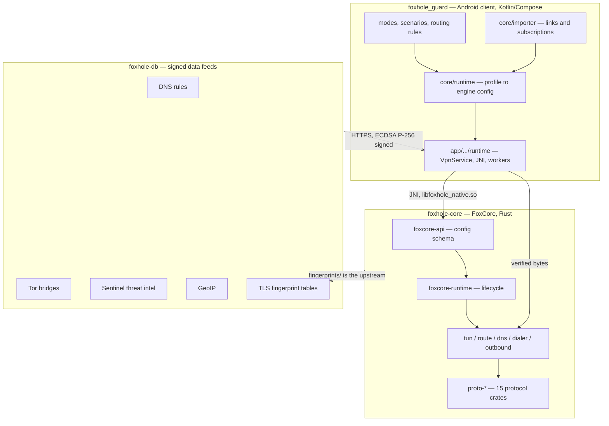
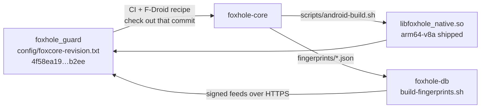

# FoxHole Core architecture

One product, three repositories. Minimum prose, maximum diagrams — read the pictures, use the text
only for what a picture cannot say.

---

## The documents

| # | Document | Covers |
|---|---|---|
| 1 | [Protocols](01-protocols.md) | every outbound, its carrier, its security layer, where it terminates, UDP support, and every fail-closed path with the reason for it |
| 2 | [Cryptography](02-cryptography.md) | per-protocol auth and KEX, the ML-KEM-768 hybrid and the ML-DSA-in-fingerprints story, REALITY's derivation step by step, and the full pinning table |
| 3 | [Updates and data delivery](03-updates-and-data-delivery.md) | the signed feeds (four published, a fifth staged), manifest + detached signature, the pinned key, rollback protection, when each document takes effect, and the APK update channel |
| 4 | [App ↔ core boundary](04-app-core-boundary.md) | profile → engine config, the JNI surface, what crosses the FFI in what form, and the VPN connect/disconnect sequences |
| 5 | [Data repository](05-data-repository.md) | what each feed is built from, by which script, and what the client checks on receipt |

---

## How the three repositories are bound together

| Binding | Mechanism |
|---|---|
| Client → core, source | Gradle resolves the sibling folder `foxhole-core`; override with `-Pfoxhole.foxCoreSourceRoot` or `FOXCORE_SOURCE_ROOT` |
| Client → core, revision | `config/foxcore-revision.txt` — CI/F-Droid check out that commit; local Gradle compares the sibling's Git HEAD (`app/build.gradle.kts:188-245`), refuses a mismatch for release tasks and prints an error banner for other tasks |
| Core → DB | `build-fingerprints.sh` sparse-checks out `foxhole-core/fingerprints/` at a pinned revision |
| DB → client | five manifests under one configurable base URL, one pinned ECDSA P-256 key |
| Release order | foxhole-db → foxhole-core → foxhole_guard → F-Droid |

Shipped ABI for the public beta is `arm64-v8a` only. `armeabi-v7a` and `x86_64` build but are not
distributed.

---

## Reading conventions

- Every `file:line` citation is relative to its repository root: `foxhole-core/`, the client
  checkout, or `foxhole-db/`.
- Claims are taken from code, not from the repositories' own READMEs. Where a README or a code
  comment disagrees with the code, the document says so in its final section rather than repeating
  the claim.
- Nothing here was verified by building or running anything.

### Where the drift lists are

Each document ends with the inconsistencies found while writing it:

| Document | Section |
|---|---|
| 2 — Cryptography | 2.7 — no open inconsistencies after the current pass |
| 3 — Updates | 3.7 — inline vs shared verifiers, permissive Kotlin vs strict Rust JSON parsing, and DNS live/start activation |
| 4 — Boundary | 4.7 — compatibility-only link/continuity ABI, DNS activation, and the divergent link parsers |
| 5 — Data repository | 5.7 — threat-intel schema pinning, `deny_unknown_fields` claim, ephemeral-key claim |
